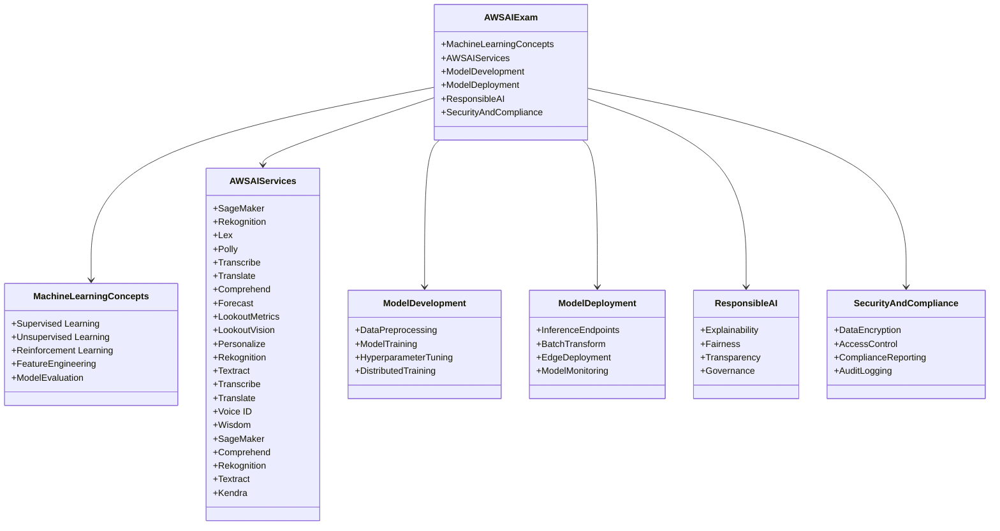
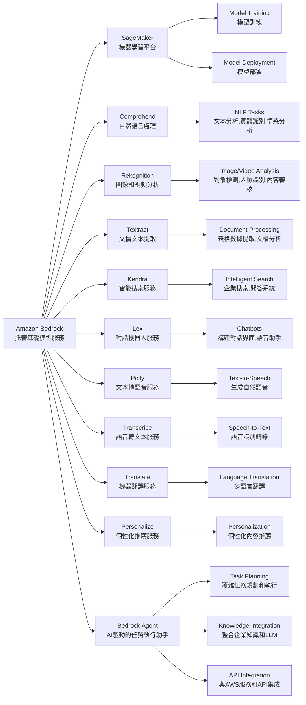
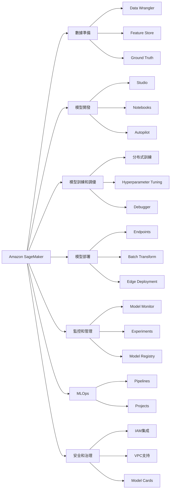
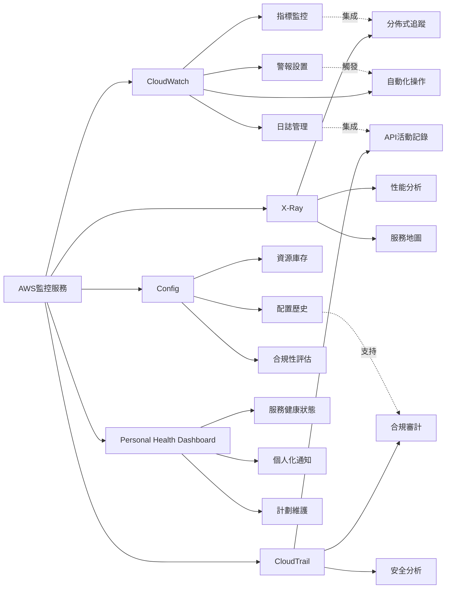

## Amazon Bedrock

Amazon Bedrock是AWS提供的一項托管服務,允許開發者通過API訪問多種基礎模型(foundation models)。以下是Bedrock的主要功能和使用方法:

主要功能:

1. 訪問多種基礎模型:
   - 包括來自AI21 Labs、Anthropic、Stability AI和Amazon等公司的模型。
   - 支持文本生成、圖像生成等任務。

2. 模型定制:
   - 允許使用自己的數據微調模型。

3. 安全性和隱私:
   - 提供私有端點和加密功能。
   - 支持對模型輸入輸出進行審計。

4. 集成AWS服務:
   - 與其他AWS服務如S3、Lambda等無縫集成。

5. 可擴展性:
   - 自動處理基礎設施,支持高並發請求。

使用方法:

1. 設置AWS賬戶和權限:
   - 確保有適當的IAM權限訪問Bedrock。

2. 選擇合適的模型:
   - 根據任務需求選擇合適的基礎模型。

3. 使用AWS SDK或CLI:
   - 可以使用Python、Java等語言的SDK。
   - 示例Python代碼:

   ```python
   import boto3

   bedrock = boto3.client('bedrock-runtime')

   prompt = "Translate the following English text to French: 'Hello, how are you?'"

   response = bedrock.invoke_model(
       modelId='anthropic.claude-v2',
       contentType='application/json',
       accept='application/json',
       body=json.dumps({
           "prompt": prompt,
           "max_tokens_to_sample": 200
       })
   )

   print(response['body'].read())
   ```

4. 處理API響應:
   - 解析返回的JSON數據,提取生成的內容。

5. 實現錯誤處理和重試機制:
   - 處理可能的API錯誤和限流情況。

6. 考慮成本優化:
   - 監控使用情況,優化提示以減少token消耗。

7. 遵循最佳實踐:
   - 使用Bedrock提供的安全功能。
   - 實施適當的內容過濾和審核機制。

8. 探索高級功能:
   - 如果需要,使用模型定制功能。

9. 監控和日志:
   - 利用AWS CloudWatch監控API調用和性能。

Bedrock為開發者提供了一種簡單的方式來利用強大的AI模型,而無需管理覆雜的基礎設施。它特別適合那些希望在應用中集成AI功能,但不想自己訓練和維護大型模型的開發者和企業。




## SageMaker Model Cards

好的,我來為您介紹Amazon SageMaker Model Cards。這是Amazon SageMaker的一個重要功能,用於記錄和共享機器學習模型的關鍵信息。以下是SageMaker Model Cards的主要特點和用途:

1. 概述:
   SageMaker Model Cards是一種標準化的方式,用於記錄機器學習模型的重要細節,包括其預期用途、性能特征、訓練數據等信息。

2. 主要功能:
   - 模型文檔化: 提供結構化的模板來記錄模型信息
   - 性能跟蹤: 記錄模型在不同數據集上的性能指標
   - 版本控制: 跟蹤模型的不同版本和變更
   - 合規性支持: 幫助滿足監管和合規要求
   - 協作共享: 便於團隊成員之間共享模型信息

3. 記錄的信息類型:
   - 模型概述: 名稱、版本、用途等
   - 訓練數據: 數據來源、預處理步驟、數據分布等
   - 模型架構: 算法類型、超參數等
   - 性能指標: 準確率、精確度、召回率等
   - 使用指南: 部署建議、最佳實踐等
   - 倫理考慮: 潛在偏見、公平性評估等
   - 維護信息: 更新歷史、責任人等

4. 使用場景:
   - 模型治理: 確保模型的可追溯性和問責制
   - 知識傳遞: 便於團隊成員了解和使用模型
   - 審計支持: 為監管審計提供必要的文檔
   - 模型選擇: 幫助用戶比較和選擇合適的模型
   - 持續改進: 跟蹤模型性能隨時間的變化

5. 創建和管理:
   - 通過SageMaker Studio界面創建
   - 使用API或SDK以編程方式管理
   - 支持導出為PDF或其他格式

6. 與其他SageMaker功能的集成:
   - Model Registry: 與模型注冊表集成,管理模型生命周期
   - Experiments: 記錄實驗結果和模型訓練過程
   - Model Monitor: 跟蹤生產環境中的模型性能

7. 優勢:
   - 提高模型透明度和可解釋性
   - 促進團隊協作和知識共享
   - 支持負責任的AI開發實踐
   - 簡化合規性和審計流程

8. 注意事項:
   - 需要定期更新以保持信息的準確性
   - 應注意保護敏感信息和知識產權
   - 模型卡片的質量依賴於創建者提供的信息的完整性和準確性

SageMaker Model Cards是一個強大的工具,可以幫助組織更好地管理和理解他們的機器學習模型。它不僅提高了模型開發過程的透明度,還支持了負責任的AI實踐,是現代機器學習工作流程中的重要組成部分。


## Amazon Macie:

Amazon Macie是AWS提供的一項完全托管的數據安全和隱私服務,它使用機器學習和模式匹配來發現、監控和保護存儲在AWS中的敏感數據。以下是Macie的主要特點和功能:

1. 核心功能:
   - 自動數據發現: 自動識別和分類存儲在S3桶中的敏感數據
   - 持續監控: 持續監控數據訪問活動和數據存儲變化
   - 風險評估: 評估數據存儲的風險並提供詳細報告
   - 警報生成: 當檢測到潛在的數據安全問題時發出警報

2. 數據類型識別:
   - 個人身份信息(PII): 如姓名、地址、社會安全號碼等
   - 金融數據: 信用卡號碼、銀行賬戶信息等
   - 醫療健康信息: 受HIPAA保護的健康信息
   - 知識產權: 源代碼、商業秘密等
   - 合規相關數據: 與GDPR、CCPA等法規相關的數據

3. 工作原理:
   - 使用機器學習模型分析數據內容和元數據
   - 應用預定義和自定義的數據識別器
   - 分析S3對象的權限和加密設置
   - 監控CloudTrail日志以檢測異常訪問模式

4. 集成與兼容性:
   - 與AWS Organizations集成,支持多賬戶管理
   - 與AWS Security Hub集成,提供集中的安全視圖
   - 支持通過Amazon EventBridge觸發自動化工作流
   - 與AWS Key Management Service (KMS)集成,支持加密管理

5. 使用場景:
   - 數據隱私合規: 幫助滿足GDPR、CCPA等法規要求
   - 數據分類: 自動識別和分類敏感數據
   - 安全態勢管理: 評估和改善數據安全狀況
   - 數據泄露防護: 檢測潛在的數據泄露風險

6. 優勢:
   - 自動化: 減少手動數據分類和監控的工作量
   - 可擴展性: 能夠處理大規模數據集
   - 準確性: 使用先進的機器學習技術提高識別準確率
   - 成本效益: 按需付費模式,無需前期投資

7. 報告和可視化:
   - 提供詳細的發現報告和風險評估
   - 支持自定義儀表板和報告
   - 與Amazon QuickSight集成,支持高級數據可視化

8. 安全性考慮:
   - Macie本身不存儲或處理實際的敏感數據內容
   - 支持使用AWS KMS進行結果加密
   - 提供細粒度的訪問控制,支持IAM策略

9. 最佳實踐:
   - 定期審查Macie發現的結果
   - 使用自定義數據標識符增強識別能力
   - 結合其他AWS安全服務(如GuardDuty)使用
   - 實施自動化響應機制處理Macie警報

Amazon Macie是一個強大的工具,特別適合需要保護大量敏感數據的組織。它不僅能幫助組織滿足各種數據保護法規的要求,還能提高整體數據安全態勢,減少數據泄露的風險。通過自動化的數據發現和持續監控,Macie可以顯著減輕數據安全管理的負擔,使組織能夠更專注於核心業務。


## AWS Glue:

AWS Glue是一個全托管的ETL(提取、轉換、加載)服務,它使得準備和加載數據以進行分析變得簡單和經濟高效。以下是AWS Glue的主要特點和功能:

1. 核心功能:
   - 數據目錄: 中央元數據存儲庫
   - ETL作業: 自動生成ETL代碼
   - 數據爬蟲: 自動發現和分類數據
   - 開發端點: 交互式開發環境

2. 數據目錄:
   - 存儲元數據信息
   - 與Amazon Athena, Amazon EMR, Amazon Redshift Spectrum集成
   - 支持多種數據格式和數據源

3. ETL作業:
   - 支持Python和Scala
   - 自動生成Apache Spark代碼
   - 支持覆雜的數據轉換和清洗操作
   - 提供內置轉換庫

4. 數據爬蟲:
   - 自動掃描數據源並推斷模式
   - 支持多種數據存儲,包括S3, RDS, DynamoDB等
   - 定期運行以保持元數據最新

5. 開發端點:
   - 提供Jupyter Notebook環境
   - 用於交互式開發和調試ETL腳本

6. 工作流:
   - 創建和管理覆雜的ETL工作流
   - 支持條件執行和錯誤處理

7. 監控和日志:
   - 與CloudWatch集成
   - 提供作業執行統計和日志

8. 安全性:
   - 支持IAM角色和策略
   - 數據加密(靜態和傳輸中)
   - VPC支持

9. 彈性和可擴展性:
   - 自動擴展資源以滿足工作負載需求
   - 按需定價模型

10. 使用場景:
    - 數據湖構建
    - 數據倉庫加載
    - 360度客戶視圖創建
    - 日志分析

11. 與其他AWS服務集成:
    - S3, RDS, Redshift, DynamoDB等數據存儲
    - EMR, Athena, QuickSight等分析服務
    - Lambda, Step Functions等計算服務

12. 優勢:
    - 無服務器架構,無需管理基礎設施
    - 自動代碼生成,減少手動編碼
    - 內置數據質量和數據準備功能
    - 成本效益高,按需付費

13. 最佳實踐:
    - 使用數據目錄作為中央元數據存儲
    - 利用數據爬蟲自動更新元數據
    - 使用開發端點進行交互式開發
    - 實施適當的安全措施,如加密和訪問控制

AWS Glue通過自動化許多覆雜的ETL任務,大大簡化了數據準備和加載過程。它特別適合需要處理大量數據,並將數據從各種源整合到數據湖或數據倉庫中的組織。Glue的無服務器架構和自動擴展能力使其成為一個高效、經濟的ETL解決方案。


## SageMaker Model Cards

好的,我將使用Mermaid為您繪制一個展示Amazon SageMaker主要功能的圖表。這個圖表將包括SageMaker的核心功能和一些重要的子功能:



這個圖表展示了Amazon SageMaker的主要功能和子功能:

1. 數據準備:
   - Data Wrangler: 數據預處理和特征工程
   - Feature Store: 特征存儲和管理
   - Ground Truth: 數據標注

2. 模型開發:
   - Studio: 集成開發環境
   - Notebooks: 交互式筆記本
   - Autopilot: 自動機器學習

3. 模型訓練和調優:
   - 分布式訓練: 支持大規模模型訓練
   - Hyperparameter Tuning: 自動超參數優化
   - Debugger: 訓練過程調試和分析

4. 模型部署:
   - Endpoints: 實時推理端點
   - Batch Transform: 批量推理
   - Edge Deployment: 邊緣設備部署

5. 監控和管理:
   - Model Monitor: 模型性能監控
   - Experiments: 實驗跟蹤和管理
   - Model Registry: 模型版本控制和管理

6. MLOps:
   - Pipelines: ML工作流管理
   - Projects: 端到端ML項目模板

7. 安全和治理:
   - IAM集成: 身份和訪問管理
   - VPC支持: 網絡隔離
   - Model Cards: 模型文檔和元數據管理

這個圖表提供了SageMaker功能的高級概覽,展示了它如何支持完整的機器學習生命周期,從數據準備到模型部署和監控。每個主要功能下都有幾個關鍵的子功能或工具,幫助用戶更好地理解SageMaker的能力範圍。


好的,我來為您比較AWS的主要監控服務。我們將使用Mermaid來創建一個比較圖表,展示不同AWS監控服務的主要特點和用途。



這個圖表比較了AWS的主要監控服務:

1. Amazon CloudWatch:
   - 主要用途: 全面的監控和可觀察性服務
   - 特點: 
     - 指標監控: 收集和追蹤關鍵指標
     - 日誌管理: 集中化日誌存儲和分析
     - 警報設置: 基於閾值的通知
     - 自動化操作: 通過與Lambda等服務集成實現自動響應

2. AWS X-Ray:
   - 主要用途: 應用程序性能分析和調試
   - 特點:
     - 分佈式追蹤: 跟踪請求在分佈式系統中的路徑
     - 性能分析: 識別性能瓶頸
     - 服務地圖: 可視化服務依賴關係

3. AWS CloudTrail:
   - 主要用途: API活動和用戶行為審計
   - 特點:
     - API活動記錄: 記錄所有AWS API調用
     - 合規審計: 支持合規性要求
     - 安全分析: 識別潛在的安全威脅

4. AWS Config:
   - 主要用途: 資源庫存和配置管理
   - 特點:
     - 資源庫存: 跟踪AWS資源配置
     - 配置歷史: 記錄配置變更歷史
     - 合規性評估: 評估資源是否符合預定義的規則

5. AWS Personal Health Dashboard:
   - 主要用途: AWS服務健康狀態監控
   - 特點:
     - 服務健康狀態: 提供AWS服務的實時健康信息
     - 個人化通知: 根據您使用的服務發送相關通知
     - 計劃維護: 提前通知計劃中的維護活動

比較和集成
- CloudWatch是核心監控服務,可以與其他服務集成
- X-Ray專注於應用程序性能,補充了CloudWatch的功能
- CloudTrail側重於安全和合規性審計
- Config提供了更深入的資源配置管理
- Personal Health Dashboard提供了AWS服務本身的健康狀態信息

選擇合適的監控服務取決於具體需求:
- 全面監控: CloudWatch
- 應用性能: X-Ray
- 安全審計: CloudTrail
- 配置管理: Config
- AWS服務狀態: Personal Health Dashboard

這些服務可以單獨使用,也可以組合使用以實現全面的監控和管理策略。