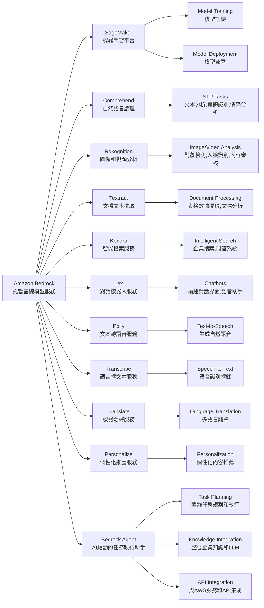
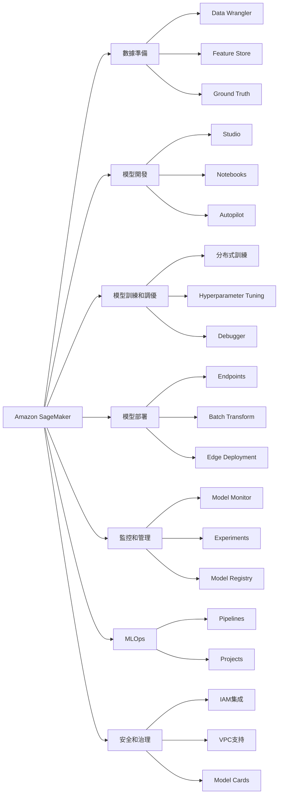
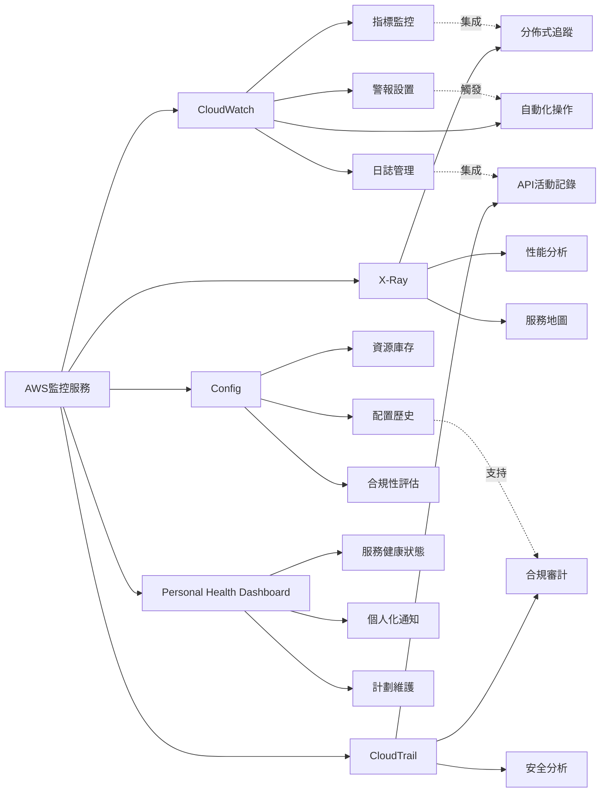

## AWS Virtual Private Cloud (VPC) 架構分析

這張手繪筆記詳細描述了 AWS Virtual Private Cloud (VPC) 的主要組成部分、網路配置和安全策略。以下是對筆記內容的逐一分析。

### 1. VPC (虛擬私有雲)

VPC 是 AWS 提供的虛擬網路環境，允許使用者建立和管理自己的私有雲。筆記中提到的關鍵概念包括：

- **Region（區域）**: AWS 的地理區域，每個區域包含多個可用區。
- **Availability Zone (AZ，可用區)**: 每個區域內的獨立位置，提供高可用性和容錯能力。VPC 可以跨多個可用區部署，以提高應用的可靠性和可用性。

### 2. 網路元件

筆記中列出了多個關鍵的網路元件，這些元件共同構成了 VPC 的網路架構：

- **Internet Gateway (網際網路閘道器)**: 允許 VPC 與網際網路連接，支持公有子網中的實例訪問外部網路[1][11][29]。

- **NAT Gateway (網路地址轉換閘道器)**: 允許私有子網中的實例訪問網際網路，而不需要公有 IP 地址，這樣可以提高安全性[1][10][32]。

- **Route Table (路由表)**: 定義 VPC 內網路流量的路由規則，確保流量能夠正確地在子網之間流動[5][6][10]。

- **Network ACL (網路存取控制清單)**: 基於子網的狀態式防火牆，控制進出流量，提供額外的安全層級[1][6][39]。

- **Security Group (安全群組)**: 基於實例的狀態式防火牆，控制入站和出站流量，通常用於保護 EC2 實例[1][6][39]。

- **Subnet (子網路)**: VPC 內的邏輯子網路區塊，可以配置為公有子網路或私有子網路。公有子網路通常用於放置需要與網際網路連接的實例，例如 Bastion Host（跳板機）[1][5][6]。

- **VPC Peering (VPC 對等連接)**: 允許兩個 VPC 之間進行網路連接，這對於跨 VPC 的資源共享非常重要。筆記中提到 IDR（Internet Data Region）網段的概念，強調了對等連接後可能出現的網段重複問題[1][5][6]。

- **Virtual Private Gateway (虛擬私有閘道器)**: 用於建立 VPN 連接，允許在 VPC 和本地網路之間建立安全的連接[1][5][6]。

- **Customer Gateway (客戶閘道器)**: 本地網路連接的閘道器，通常與虛擬私有閘道器配合使用[1][5][6]。

- **Endpoint (端點)**: 允許直接從 VPC 連接到 AWS 服務，而不需通過網際網路，這樣可以提高安全性和性能[1][5][6]。

### 3. 安全策略

筆記中提到的安全策略包括：

- **Stateless 防火牆 (無狀態防火牆)**: 基於 Network ACL 實現，僅根據封包標頭進行流量控制，這意味著每個封包都是獨立處理的，無法記住之前的狀態[1][6][39]。

- **Stateful 防火牆 (有狀態防火牆)**: 由 Security Group 實現，能夠記住連接的狀態，這樣可以更靈活地控制流量，允許回應流量而不需要額外的規則[1][6][39]。

### 總結

這張手繪筆記清晰地展示了 AWS VPC 的架構及其組成部分，幫助使用者理解如何在 AWS 環境中設計和管理虛擬網路。透過這些元件和安全策略的組合，使用者可以建立一個安全、可擴展的雲端基礎設施，滿足各種業務需求。
[1] https://docs.aws.amazon.com/zh_cn/vpc/latest/userguide/configure-your-vpc.html
[2] https://docs.aws.amazon.com/zh_cn/workspaces-web/latest/adminguide/create-vpc.html
[3] https://docs.aws.amazon.com/ja_jp/vpc/latest/userguide/how-it-works.html
[4] https://www.stylez.co.jp/aws_columns/understand_the_basics_of_aws_networking/learn_aws_vpc_from_the_basics/
[5] https://docs.aws.amazon.com/zh_cn/vpc/latest/userguide/how-it-works.html
[6] https://docs.aws.amazon.com/zh_cn/vpc/latest/userguide/configure-subnets.html
[7] https://docs.aws.amazon.com/zh_cn/whitepapers/latest/aws-vpc-connectivity-options/network-to-amazon-vpc-connectivity-options.html
[8] http://www.coding-daddy.com/other/aws-deploy.html
[9] https://zenn.dev/mi_01_24fu/articles/1bac0febb8c175
[10] https://docs.aws.amazon.com/zh_cn/vpc/latest/userguide/vpc-igw-internet-access.html
[11] https://docs.aws.amazon.com/zh_cn/vpc/latest/userguide/VPC_Internet_Gateway.html
[12] https://repost.aws/zh-Hans/knowledge-center/instance-vpc-troubleshoot
[13] https://blog.csdn.net/dietime1943/article/details/130399293
[14] https://techblog.techfirm.co.jp/entry/awssummary-vpc
[15] https://aws.amazon.com/jp/vpc/faqs/
[16] https://medium.com/@jamie-life-coding/%E5%A4%A7%E8%A9%B1aws-%E9%9B%B2%E7%AB%AF%E6%9E%B6%E6%A7%8B%E8%AE%80%E6%9B%B8%E5%BF%83%E5%BE%97-iam-vpc-7561462e6a3d
[17] https://hackmd.io/@AWSlearning/BJvnmhRg2
[18] https://qiita.com/c60evaporator/items/2f24d4796202e8b06a77
[19] https://www.sbbit.jp/article/cont1/51188
[20] https://docs.aws.amazon.com/network-firewall/latest/developerguide/arch-igw-ngw.html
[21] https://www.quora.com/What-is-the-difference-between-an-Availability-Zone-AZ-and-a-subnet-in-Amazon-Web-Services-AWS
[22] https://qiita.com/morih90/items/d21d72364fd01e0d0169
[23] https://www.bold.ne.jp/engineer-club/aws-vpc
[24] https://docs.aws.amazon.com/ja_jp/vpc/latest/userguide/vpc-examples-intro.html
[25] https://pavolkutaj.medium.com/explaining-vpc-subnets-regions-and-availability-zones-in-aws-abb5e5a70a5f
[26] https://blog.father.gedow.net/2024/04/03/what-is-the-aws-vpc-best-practice/
[27] https://docs.aws.amazon.com/zh_tw/vpc/latest/userguide/vpc-examples-intro.html
[28] https://d1.awsstatic.com/events/jp/2017/summit/slide/D2T3-5.pdf
[29] https://docs.aws.amazon.com/vpc/latest/userguide/VPC_Internet_Gateway.html
[30] https://docs.aws.amazon.com/network-firewall/latest/developerguide/arch-single-zone-igw.html
[31] https://docs.aws.amazon.com/vpc/latest/userguide/vpc-igw-internet-access.html
[32] https://medium.com/awesome-cloud/aws-vpc-difference-between-internet-gateway-and-nat-gateway-c9177e710af6
[33] https://docs.aws.amazon.com/vpc/latest/userguide/working-with-igw.html
[34] https://devopsrealtime.com/aws-ec2-region-vs-vpc-vs-azs/
[35] https://stackoverflow.com/questions/38690012/aws-vpc-internet-gateway-vs-nat
[36] https://www.youtube.com/watch?v=u7obme-h3bc
[37] https://docs.aws.amazon.com/vpc/latest/userguide/what-is-amazon-vpc.html
[38] https://repost.aws/knowledge-center/create-attach-igw-vpc
[39] https://docs.aws.amazon.com/zh_cn/vpc/latest/userguide/vpc-security-best-practices.html
[40] https://aws.amazon.com/cn/blogs/china/ten-best-practices-for-vpc-security/
[41] https://docs.aws.amazon.com/zh_cn/waf/latest/developerguide/security-group-policies.html
[42] https://docs.aws.amazon.com/zh_cn/vpc/latest/userguide/infrastructure-security.html
[43] https://docs.aws.amazon.com/zh_tw/vpc/latest/userguide/vpc-security-best-practices.html
[44] https://docs.aws.amazon.com/zh_cn/vpc/latest/userguide/vpc-policy-examples.html
[45] https://docs.aws.amazon.com/zh_cn/vpc/latest/userguide/VPC_Security.html
[46] https://docs.aws.amazon.com/zh_cn/waf/latest/developerguide/getting-started-fms-security-group.html
[47] https://docs.aws.amazon.com/zh_cn/vpc/latest/userguide/security.html
[48] https://cloud.ibm.com/docs/vpc?topic=vpc-aws-config&locale=zh-CN
[49] https://business.ntt-east.co.jp/content/cloudsolution/ih_column-137.html
[50] https://docs.aws.amazon.com/ja_jp/vpc/latest/userguide/vpc-getting-started.html
[51] https://blog.serverworks.co.jp/2023/04/10/142451
[52] https://docs.aws.amazon.com/AWSEC2/latest/UserGuide/using-regions-availability-zones.html
[53] https://docs.aws.amazon.com/prescriptive-guidance/latest/patterns/use-consistent-availability-zones-in-vpcs-across-different-aws-accounts.html
[54] https://bluexp.netapp.com/blog/aws-availability-zones-architecture-how-to-select
[55] https://docs.aws.amazon.com/AmazonRDS/latest/UserGuide/Concepts.RegionsAndAvailabilityZones.html
[56] https://jayendrapatil.com/aws-global-vs-regional-vs-az-resources/
[57] https://www.reddit.com/r/aws/comments/oax60y/vpc_and_availability_zone/
[58] https://www.techtarget.com/searchcloudcomputing/tip/Understand-AWS-Regions-vs-Availability-Zones## AWS 共同責任模型

**概述**

AWS 共同責任模型是一種安全框架，旨在明確劃分 AWS 和客戶在雲端安全和合規性方面的責任。這一模型的核心理念是，AWS 負責「雲端的安全性」，而客戶則負責「雲端中的安全性」。

**責任劃分**

1. **AWS 的責任（雲端的安全性）**：
   - AWS 負責保護運行所有 AWS 服務的基礎設施，包括硬體、軟體、網路和設施的安全。
   - AWS 管理和控制主機操作系統及虛擬化層的安全性，並確保物理設施的安全性。

2. **客戶的責任（雲端中的安全性）**：
   - 客戶需管理其在 AWS 上運行的應用程序和數據的安全性，包括操作系統的更新和安全補丁。
   - 客戶還需配置 AWS 提供的安全組防火牆，並負責身份和訪問管理（IAM）以及數據加密等安全措施。

**具體責任範圍**

- **基礎設施層**：AWS 負責物理和環境控制，客戶則需管理其應用程序和數據的安全。
  
- **服務層**：對於如 Amazon EC2 這類基礎設施即服務（IaaS），客戶需負責所有必要的安全配置和管理任務。對於更抽象的服務，如 Amazon S3 和 DynamoDB，AWS 負責基礎設施層的安全，而客戶則需管理其數據的安全性。

**最佳實踐**

- 客戶應根據所選擇的 AWS 服務，仔細考慮其安全責任，並根據組織的需求和適用的法律法規進行相應的安全配置。
  
- AWS 提供的工具和服務（如 AWS CloudTrail 和 AWS Config）可以幫助客戶監控和管理其安全配置，從而減輕操作負擔。

**結論**

AWS 共同責任模型不僅有助於明確責任劃分，還為客戶提供了必要的靈活性和控制權，以便在 AWS 雲中安全地部署其基礎設施。這一模型的有效實施能夠顯著提高雲端環境的安全性和合規性[2][4][5][7][20]。
[1] https://www.w3schools.com/aws/aws_cloudessentials_sec_sharedresponsibilitymodel.php
[2] https://medium.com/@abc822162001/day2-aws-shared-responsibility-model-1290954f37f4
[3] https://www.barracuda.com/support/glossary/aws-shared-security-model
[4] https://digitalcloud.training/aws-shared-responsibility-model/
[5] https://www.veeam.com/blog/aws-shared-responsibility-model.html
[6] https://docs.aws.amazon.com/whitepapers/latest/security-overview-aws-lambda/the-shared-responsibility-model.html
[7] https://docs.aws.amazon.com/wellarchitected/latest/security-pillar/shared-responsibility.html
[8] https://docs.aws.amazon.com/whitepapers/latest/navigating-gdpr-compliance/shared-security-responsibility-model.html
[9] https://docs.aws.amazon.com/zh_tw/AmazonRDS/latest/UserGuide/UsingWithRDS.html
[10] https://d1.awsstatic.com/whitepapers/compliance/TW_Whitepapers/AWS_Compliance_Quick_Reference.64bf770f48e671da69f23badaf77b6d0a5f8813f.pdf
[11] https://docs.aws.amazon.com/zh_tw/prescriptive-guidance/latest/security-reference-architecture/foundations.html
[12] https://d1.awsstatic.com/whitepapers/zh_CN/compliance/GDPR_Compliance_on_AWS.pdf
[13] https://aws.amazon.com/compliance/shared-responsibility-model/
[14] https://unwire.hk/2024/06/26/aws-cloud/genai-and-cloud/
[15] https://docs.aws.amazon.com/whitepapers/latest/introduction-devops-aws/shared-responsibility.html
[16] https://aws.amazon.com/tw/compliance/fedramp/
[17] http://download.iteablue.com/AWS%20%20300%E6%9C%AC%E7%99%BD%E7%9A%AE%E4%B9%A6/AWS%20%E7%99%BD%E7%9A%AE%E4%B9%A6%20%E2%80%94%20%E6%A1%86%E6%9E%B6%E5%92%8C%E6%96%B9%E6%B3%95/AWS%20%E4%BA%91%E9%87%87%E7%94%A8%E6%A1%86%E6%9E%B6%EF%BC%9A%E5%AE%89%E5%85%A8%E6%80%A7%E5%89%8D%E6%99%AF.pdf
[18] https://dev.amazoncloud.cn/activity/activityDetail/meetup?id=66a070ad1968353bac3fd4c8
[19] https://a4ws.org/wp-content/uploads/2020/05/AWS-Standard-2.0-General-Guidance-Chinese.pdf
[20] https://docs.aws.amazon.com/whitepapers/latest/applying-security-practices-to-network-workload-for-csps/the-shared-responsibility-model.html


## Amazon Bedrock

Amazon Bedrock是AWS提供的一項托管服務,允許開發者通過API訪問多種基礎模型(foundation models)。以下是Bedrock的主要功能和使用方法:

主要功能:

1. 訪問多種基礎模型:
   - 包括來自AI21 Labs、Anthropic、Stability AI和Amazon等公司的模型。
   - 支持文本生成、圖像生成等任務。

2. 模型定制:
   - 允許使用自己的數據微調模型。

3. 安全性和隱私:
   - 提供私有端點和加密功能。
   - 支持對模型輸入輸出進行審計。

4. 集成AWS服務:
   - 與其他AWS服務如S3、Lambda等無縫集成。

5. 可擴展性:
   - 自動處理基礎設施,支持高並發請求。

使用方法:

1. 設置AWS賬戶和權限:
   - 確保有適當的IAM權限訪問Bedrock。

2. 選擇合適的模型:
   - 根據任務需求選擇合適的基礎模型。

3. 使用AWS SDK或CLI:
   - 可以使用Python、Java等語言的SDK。
   - 示例Python代碼:

   ```python
   import boto3

   bedrock = boto3.client('bedrock-runtime')

   prompt = "Translate the following English text to French: 'Hello, how are you?'"

   response = bedrock.invoke_model(
       modelId='anthropic.claude-v2',
       contentType='application/json',
       accept='application/json',
       body=json.dumps({
           "prompt": prompt,
           "max_tokens_to_sample": 200
       })
   )

   print(response['body'].read())
   ```

4. 處理API響應:
   - 解析返回的JSON數據,提取生成的內容。

5. 實現錯誤處理和重試機制:
   - 處理可能的API錯誤和限流情況。

6. 考慮成本優化:
   - 監控使用情況,優化提示以減少token消耗。

7. 遵循最佳實踐:
   - 使用Bedrock提供的安全功能。
   - 實施適當的內容過濾和審核機制。

8. 探索高級功能:
   - 如果需要,使用模型定制功能。

9. 監控和日志:
   - 利用AWS CloudWatch監控API調用和性能。

Bedrock為開發者提供了一種簡單的方式來利用強大的AI模型,而無需管理覆雜的基礎設施。它特別適合那些希望在應用中集成AI功能,但不想自己訓練和維護大型模型的開發者和企業。




## SageMaker Model Cards

好的,我來為您介紹Amazon SageMaker Model Cards。這是Amazon SageMaker的一個重要功能,用於記錄和共享機器學習模型的關鍵信息。以下是SageMaker Model Cards的主要特點和用途:

1. 概述:
   SageMaker Model Cards是一種標準化的方式,用於記錄機器學習模型的重要細節,包括其預期用途、性能特征、訓練數據等信息。

2. 主要功能:
   - 模型文檔化: 提供結構化的模板來記錄模型信息
   - 性能跟蹤: 記錄模型在不同數據集上的性能指標
   - 版本控制: 跟蹤模型的不同版本和變更
   - 合規性支持: 幫助滿足監管和合規要求
   - 協作共享: 便於團隊成員之間共享模型信息

3. 記錄的信息類型:
   - 模型概述: 名稱、版本、用途等
   - 訓練數據: 數據來源、預處理步驟、數據分布等
   - 模型架構: 算法類型、超參數等
   - 性能指標: 準確率、精確度、召回率等
   - 使用指南: 部署建議、最佳實踐等
   - 倫理考慮: 潛在偏見、公平性評估等
   - 維護信息: 更新歷史、責任人等

4. 使用場景:
   - 模型治理: 確保模型的可追溯性和問責制
   - 知識傳遞: 便於團隊成員了解和使用模型
   - 審計支持: 為監管審計提供必要的文檔
   - 模型選擇: 幫助用戶比較和選擇合適的模型
   - 持續改進: 跟蹤模型性能隨時間的變化

5. 創建和管理:
   - 通過SageMaker Studio界面創建
   - 使用API或SDK以編程方式管理
   - 支持導出為PDF或其他格式

6. 與其他SageMaker功能的集成:
   - Model Registry: 與模型注冊表集成,管理模型生命周期
   - Experiments: 記錄實驗結果和模型訓練過程
   - Model Monitor: 跟蹤生產環境中的模型性能

7. 優勢:
   - 提高模型透明度和可解釋性
   - 促進團隊協作和知識共享
   - 支持負責任的AI開發實踐
   - 簡化合規性和審計流程

8. 注意事項:
   - 需要定期更新以保持信息的準確性
   - 應注意保護敏感信息和知識產權
   - 模型卡片的質量依賴於創建者提供的信息的完整性和準確性

SageMaker Model Cards是一個強大的工具,可以幫助組織更好地管理和理解他們的機器學習模型。它不僅提高了模型開發過程的透明度,還支持了負責任的AI實踐,是現代機器學習工作流程中的重要組成部分。


## Amazon Macie:

Amazon Macie是AWS提供的一項完全托管的數據安全和隱私服務,它使用機器學習和模式匹配來發現、監控和保護存儲在AWS中的敏感數據。以下是Macie的主要特點和功能:

1. 核心功能:
   - 自動數據發現: 自動識別和分類存儲在S3桶中的敏感數據
   - 持續監控: 持續監控數據訪問活動和數據存儲變化
   - 風險評估: 評估數據存儲的風險並提供詳細報告
   - 警報生成: 當檢測到潛在的數據安全問題時發出警報

2. 數據類型識別:
   - 個人身份信息(PII): 如姓名、地址、社會安全號碼等
   - 金融數據: 信用卡號碼、銀行賬戶信息等
   - 醫療健康信息: 受HIPAA保護的健康信息
   - 知識產權: 源代碼、商業秘密等
   - 合規相關數據: 與GDPR、CCPA等法規相關的數據

3. 工作原理:
   - 使用機器學習模型分析數據內容和元數據
   - 應用預定義和自定義的數據識別器
   - 分析S3對象的權限和加密設置
   - 監控CloudTrail日志以檢測異常訪問模式

4. 集成與兼容性:
   - 與AWS Organizations集成,支持多賬戶管理
   - 與AWS Security Hub集成,提供集中的安全視圖
   - 支持通過Amazon EventBridge觸發自動化工作流
   - 與AWS Key Management Service (KMS)集成,支持加密管理

5. 使用場景:
   - 數據隱私合規: 幫助滿足GDPR、CCPA等法規要求
   - 數據分類: 自動識別和分類敏感數據
   - 安全態勢管理: 評估和改善數據安全狀況
   - 數據泄露防護: 檢測潛在的數據泄露風險

6. 優勢:
   - 自動化: 減少手動數據分類和監控的工作量
   - 可擴展性: 能夠處理大規模數據集
   - 準確性: 使用先進的機器學習技術提高識別準確率
   - 成本效益: 按需付費模式,無需前期投資

7. 報告和可視化:
   - 提供詳細的發現報告和風險評估
   - 支持自定義儀表板和報告
   - 與Amazon QuickSight集成,支持高級數據可視化

8. 安全性考慮:
   - Macie本身不存儲或處理實際的敏感數據內容
   - 支持使用AWS KMS進行結果加密
   - 提供細粒度的訪問控制,支持IAM策略

9. 最佳實踐:
   - 定期審查Macie發現的結果
   - 使用自定義數據標識符增強識別能力
   - 結合其他AWS安全服務(如GuardDuty)使用
   - 實施自動化響應機制處理Macie警報

Amazon Macie是一個強大的工具,特別適合需要保護大量敏感數據的組織。它不僅能幫助組織滿足各種數據保護法規的要求,還能提高整體數據安全態勢,減少數據泄露的風險。通過自動化的數據發現和持續監控,Macie可以顯著減輕數據安全管理的負擔,使組織能夠更專注於核心業務。


## AWS Glue:

AWS Glue是一個全托管的ETL(提取、轉換、加載)服務,它使得準備和加載數據以進行分析變得簡單和經濟高效。以下是AWS Glue的主要特點和功能:

1. 核心功能:
   - 數據目錄: 中央元數據存儲庫
   - ETL作業: 自動生成ETL代碼
   - 數據爬蟲: 自動發現和分類數據
   - 開發端點: 交互式開發環境

2. 數據目錄:
   - 存儲元數據信息
   - 與Amazon Athena, Amazon EMR, Amazon Redshift Spectrum集成
   - 支持多種數據格式和數據源

3. ETL作業:
   - 支持Python和Scala
   - 自動生成Apache Spark代碼
   - 支持覆雜的數據轉換和清洗操作
   - 提供內置轉換庫

4. 數據爬蟲:
   - 自動掃描數據源並推斷模式
   - 支持多種數據存儲,包括S3, RDS, DynamoDB等
   - 定期運行以保持元數據最新

5. 開發端點:
   - 提供Jupyter Notebook環境
   - 用於交互式開發和調試ETL腳本

6. 工作流:
   - 創建和管理覆雜的ETL工作流
   - 支持條件執行和錯誤處理

7. 監控和日志:
   - 與CloudWatch集成
   - 提供作業執行統計和日志

8. 安全性:
   - 支持IAM角色和策略
   - 數據加密(靜態和傳輸中)
   - VPC支持

9. 彈性和可擴展性:
   - 自動擴展資源以滿足工作負載需求
   - 按需定價模型

10. 使用場景:
    - 數據湖構建
    - 數據倉庫加載
    - 360度客戶視圖創建
    - 日志分析

11. 與其他AWS服務集成:
    - S3, RDS, Redshift, DynamoDB等數據存儲
    - EMR, Athena, QuickSight等分析服務
    - Lambda, Step Functions等計算服務

12. 優勢:
    - 無服務器架構,無需管理基礎設施
    - 自動代碼生成,減少手動編碼
    - 內置數據質量和數據準備功能
    - 成本效益高,按需付費

13. 最佳實踐:
    - 使用數據目錄作為中央元數據存儲
    - 利用數據爬蟲自動更新元數據
    - 使用開發端點進行交互式開發
    - 實施適當的安全措施,如加密和訪問控制

AWS Glue通過自動化許多覆雜的ETL任務,大大簡化了數據準備和加載過程。它特別適合需要處理大量數據,並將數據從各種源整合到數據湖或數據倉庫中的組織。Glue的無服務器架構和自動擴展能力使其成為一個高效、經濟的ETL解決方案。


## SageMaker Model Cards

好的,我將使用Mermaid為您繪制一個展示Amazon SageMaker主要功能的圖表。這個圖表將包括SageMaker的核心功能和一些重要的子功能:



這個圖表展示了Amazon SageMaker的主要功能和子功能:

1. 數據準備:
   - Data Wrangler: 數據預處理和特征工程
   - Feature Store: 特征存儲和管理
   - Ground Truth: 數據標注

2. 模型開發:
   - Studio: 集成開發環境
   - Notebooks: 交互式筆記本
   - Autopilot: 自動機器學習

3. 模型訓練和調優:
   - 分布式訓練: 支持大規模模型訓練
   - Hyperparameter Tuning: 自動超參數優化
   - Debugger: 訓練過程調試和分析

4. 模型部署:
   - Endpoints: 實時推理端點
   - Batch Transform: 批量推理
   - Edge Deployment: 邊緣設備部署

5. 監控和管理:
   - Model Monitor: 模型性能監控
   - Experiments: 實驗跟蹤和管理
   - Model Registry: 模型版本控制和管理

6. MLOps:
   - Pipelines: ML工作流管理
   - Projects: 端到端ML項目模板

7. 安全和治理:
   - IAM集成: 身份和訪問管理
   - VPC支持: 網絡隔離
   - Model Cards: 模型文檔和元數據管理

這個圖表提供了SageMaker功能的高級概覽,展示了它如何支持完整的機器學習生命周期,從數據準備到模型部署和監控。每個主要功能下都有幾個關鍵的子功能或工具,幫助用戶更好地理解SageMaker的能力範圍。


好的,我來為您比較AWS的主要監控服務。我們將使用Mermaid來創建一個比較圖表,展示不同AWS監控服務的主要特點和用途。



這個圖表比較了AWS的主要監控服務:

1. Amazon CloudWatch:
   - 主要用途: 全面的監控和可觀察性服務
   - 特點: 
     - 指標監控: 收集和追蹤關鍵指標
     - 日誌管理: 集中化日誌存儲和分析
     - 警報設置: 基於閾值的通知
     - 自動化操作: 通過與Lambda等服務集成實現自動響應

2. AWS X-Ray:
   - 主要用途: 應用程序性能分析和調試
   - 特點:
     - 分佈式追蹤: 跟踪請求在分佈式系統中的路徑
     - 性能分析: 識別性能瓶頸
     - 服務地圖: 可視化服務依賴關係

3. AWS CloudTrail:
   - 主要用途: API活動和用戶行為審計
   - 特點:
     - API活動記錄: 記錄所有AWS API調用
     - 合規審計: 支持合規性要求
     - 安全分析: 識別潛在的安全威脅

4. AWS Config:
   - 主要用途: 資源庫存和配置管理
   - 特點:
     - 資源庫存: 跟踪AWS資源配置
     - 配置歷史: 記錄配置變更歷史
     - 合規性評估: 評估資源是否符合預定義的規則

5. AWS Personal Health Dashboard:
   - 主要用途: AWS服務健康狀態監控
   - 特點:
     - 服務健康狀態: 提供AWS服務的實時健康信息
     - 個人化通知: 根據您使用的服務發送相關通知
     - 計劃維護: 提前通知計劃中的維護活動

比較和集成
- CloudWatch是核心監控服務,可以與其他服務集成
- X-Ray專注於應用程序性能,補充了CloudWatch的功能
- CloudTrail側重於安全和合規性審計
- Config提供了更深入的資源配置管理
- Personal Health Dashboard提供了AWS服務本身的健康狀態信息

選擇合適的監控服務取決於具體需求:
- 全面監控: CloudWatch
- 應用性能: X-Ray
- 安全審計: CloudTrail
- 配置管理: Config
- AWS服務狀態: Personal Health Dashboard

這些服務可以單獨使用,也可以組合使用以實現全面的監控和管理策略。

AWS 提供多種與人工智慧（AI）相關的服務和工具，這些服務和工具涵蓋了從數據標註到模型部署的各個方面。以下是您提到的各項服務的簡要介紹：

## 1. Bedrock
Amazon Bedrock 是一個完全託管的服務，提供來自領先 AI 公司的高性能基礎模型（Foundation Models），用於構建生成式 AI 應用程序。這些模型可以通過 API 訪問，幫助用戶快速開發和擴展生成式 AI 應用程序[10][12][14]。

## 2. CloudTrail
AWS CloudTrail 是一項服務，能夠記錄和監控 AWS 賬戶中的 API 調用和用戶活動。它有助於實現治理、合規性、操作審計和風險審計[21][22][23]。

## 3. Artifact
AWS Artifact 是一個自助服務的中央資源庫，提供與 AWS 合規性相關的報告和協議。用戶可以按需訪問這些文件，以滿足合規性要求[31][32][33]。

## 4. Clarify
Amazon SageMaker Clarify 提供工具來檢測和解釋機器學習模型中的偏差。它幫助開發者了解模型的預測過程，並確保模型的公平性和透明度[41][45][50]。

## 5. Ground Truth
Amazon SageMaker Ground Truth 是一個數據標註服務，提供人機協作的標註功能，幫助用戶構建高質量的訓練數據集。它支持自動化標註和人工標註相結合的方式[51][54][55]。

## 6. OpenSearch
Amazon OpenSearch Service 是一個完全託管的服務，用於搜索、分析和可視化大規模數據。它基於開源的 Elasticsearch 和 Kibana，適用於實時應用程序監控、日誌分析和其他搜索應用[未在搜索結果中找到具體信息]。

## 7. PrivateLink
AWS PrivateLink 允許用戶在 AWS 網絡內安全地訪問服務，而不需要暴露到公共互聯網。它提供了私有連接，確保數據的安全性和隱私性[未在搜索結果中找到具體信息]。

## 8. Textract
Amazon Textract 是一項機器學習服務，能夠自動提取掃描文件中的文本、表格和其他數據。它適用於數據提取和文檔處理應用[未在搜索結果中找到具體信息]。

## 9. QuickSight
Amazon QuickSight 是一個快速、易用的商業智能服務，允許用戶創建和發布互動式儀表板，並從數據中獲取洞察。它支持多種數據源和豐富的可視化選項[未在搜索結果中找到具體信息]。

## 10. Guardrails
AWS Guardrails 是一組預定義的安全和合規性控制，幫助用戶在 AWS 環境中實現最佳實踐。它們通常與 AWS Control Tower 一起使用，以管理多賬戶環境[未在搜索結果中找到具體信息]。

## 11. Canvas
Amazon SageMaker Canvas 是一個無代碼的機器學習服務，允許用戶通過拖放界面構建和部署機器學習模型，適合非技術用戶[未在搜索結果中找到具體信息]。

## 12. JumpStart
Amazon SageMaker JumpStart 提供預構建的模型和端到端解決方案，幫助用戶快速開始機器學習項目。它包括各種預訓練模型和示例應用程序[未在搜索結果中找到具體信息]。

## 13. Feature Store
Amazon SageMaker Feature Store 是一個完全託管的服務，用於存儲、共享和管理機器學習特徵。它幫助團隊在不同的機器學習項目中重用特徵[未在搜索結果中找到具體信息]。

## 14. Comprehend
Amazon Comprehend 是一項自然語言處理（NLP）服務，能夠從文本中提取有意義的信息，如情感分析、實體識別和主題建模[未在搜索結果中找到具體信息]。

## 15. Amazon Q Developer
Amazon Q 是一個針對量子計算的服務，提供量子計算資源和工具，幫助開發者構建和運行量子算法[未在搜索結果中找到具體信息]。

這些服務和工具共同構成了 AWS 的強大 AI 和機器學習生態系統，幫助用戶在各種應用場景中實現智能化和自動化。
[1] https://www.aboutamazon.com/news/aws/aws-certifications-generative-ai-machine-learning-cloud-jobs
[2] https://aws.amazon.com/cn/certification/certified-ai-practitioner/
[3] https://aws.amazon.com/tw/certification/certified-ai-practitioner/
[4] https://aws.amazon.com/certification/certified-ai-practitioner/
[5] https://d1.awsstatic.com/zh_TW/training-and-certification/docs/AWS_certification_paths.pdf
[6] https://aws.amazon.com/cn/certification/certified-machine-learning-specialty/
[7] https://aws.amazon.com/tw/training/learn-about/machine-learning/
[8] https://aws.amazon.com/tw/certification/certified-machine-learning-specialty/
[9] https://dev.amazoncloud.cn/learn/aitalent?visitfrom=infoq1
[10] https://support.anthropic.com/en/articles/7996918-what-is-aws-bedrock
[11] https://www.youtube.com/watch?v=2maPaQutcWs
[12] https://aws.amazon.com/bedrock/
[13] https://www.fool.com/terms/a/amazon-bedrock/
[14] https://www.aboutamazon.com/news/aws/aws-amazon-bedrock-general-availability-generative-ai-innovations
[15] https://docs.aws.amazon.com/decision-guides/latest/bedrock-or-sagemaker/bedrock-or-sagemaker.html
[16] https://www.youtube.com/watch?v=yixsyncC2rs
[17] https://www.youtube.com/watch?v=nSQrY-uPWLY
[18] https://docs.litellm.ai/docs/providers/bedrock
[19] https://www.udemy.com/course/amazon-bedrock-aws-generative-ai-beginner-to-advanced/
[20] https://www.aboutamazon.com/news/aws/amazon-bedrock-new-innovations-generative-ai-applications
[21] https://aws.amazon.com/cloudtrail/
[22] https://docs.aws.amazon.com/awscloudtrail/latest/userguide/cloudtrail-user-guide.html
[23] https://www.geeksforgeeks.org/aws-cloudtrail/
[24] https://docs.aws.amazon.com/awscloudtrail/latest/userguide/cloudtrail-concepts.html
[25] https://www.sumologic.com/blog/what-is-aws-cloudtrail/
[26] https://www.amazonaws.cn/en/cloudtrail/
[27] https://docs.logz.io/docs/shipping/aws/aws-cloudtrail/
[28] https://docs.aws.amazon.com/govcloud-us/latest/UserGuide/govcloud-ct.html
[29] https://docs.datadoghq.com/integrations/amazon_cloudtrail/
[30] https://www.elastic.co/docs/current/integrations/aws/cloudtrail
[31] https://aws.amazon.com/artifact/
[32] https://aws.amazon.com/compliance/faq/
[33] https://jaytillu.medium.com/what-is-aws-artifact-45e1179ce762
[34] https://aws.amazon.com/compliance/soc-faqs/
[35] https://repost.aws/tags/TAJxJ4OH-eTUys7zuBrKvdiw
[36] https://tutorialsdojo.com/aws-artifact/
[37] https://repost.aws/knowledge-center/download-share-artifact-documents
[38] https://www.youtube.com/watch?v=TLtdmonA42o
[39] https://awscli.amazonaws.com/v2/documentation/api/latest/reference/artifact/index.html
[40] https://www.applytosupply.digitalmarketplace.service.gov.uk/g-cloud/services/863957576576436
[41] https://aws.amazon.com/sagemaker/clarify/
[42] https://docs.aws.amazon.com/sagemaker/latest/dg/autopilot-explainability.html
[43] https://github.com/aws/amazon-sagemaker-clarify
[44] https://sagemaker-examples.readthedocs.io/en/latest/sagemaker-clarify/index.html
[45] https://www.amazonaws.cn/en/sagemaker/clarify/
[46] https://www.youtube.com/watch?v=cTa5HYCxTVg
[47] https://www.youtube.com/watch?v=jvcPZmnXaxo
[48] https://tutorialsdojo.com/amazon-ai-fairness-and-explainability-with-amazon-sagemaker-clarify/
[49] https://www.youtube.com/watch?v=1EFECy0Ay5s
[50] https://www.cloudthat.com/resources/blog/amazon-sagemaker-clarify-for-bias-detection-in-machine-learning-models
[51] https://aws.amazon.com/sagemaker/groundtruth/
[52] https://docs.aws.amazon.com/sagemaker/latest/dg/sms.html
[53] https://docs.aws.amazon.com/sagemaker/latest/dg/gtp.html
[54] https://www.youtube.com/watch?v=_FPI6KjDlCI
[55] https://docs.aws.amazon.com/sagemaker/latest/dg/sms-automated-labeling.html
[56] https://pages.awscloud.com/Introducing-Amazon-SageMaker-Ground-Truth_1201-MCL_OD.html
[57] https://docs.aws.amazon.com/sagemaker/latest/dg/sms-getting-started.html
[58] https://www.youtube.com/watch?v=beknlA2BHGo
[59] https://docs.aws.amazon.com/sagemaker/latest/dg/sms-workforce-management.html
[60] https://medium.com/codex/leveraging-aws-for-high-traffic-event-management-aws-sagemaker-ground-truth-for-streamlining-data-f5e7560bde10

在 AWS 上，特徵工程是機器學習工作流程中的關鍵步驟，涉及從原始數據中提取、轉換和選擇特徵，以提高模型的性能和準確性。AWS 提供了多種工具和服務來幫助用戶進行特徵工程。以下是 AWS 用於特徵工程的主要工具和方法：

## AWS 用於特徵工程的工具和服務

### **1. Amazon SageMaker Data Wrangler**
Amazon SageMaker Data Wrangler 是一個強大的工具，提供了一個可視化界面，幫助用戶簡化數據準備和特徵工程過程。主要功能包括：
- **數據選取和導入**：從多種數據來源（如 Amazon S3、Redshift、RDS 等）選取和導入數據[4][6]。
- **數據轉換**：內建超過 300 種數據轉換功能，無需編寫代碼即可進行數據清理、轉換和合併[4][6]。
- **數據可視化**：提供多種可視化工具（如長條圖、散佈圖、箱線圖等），幫助用戶進行探索性數據分析[4][6]。

### **2. Amazon SageMaker Feature Store**
Amazon SageMaker Feature Store 是一個完全託管的特徵存儲庫，用於存儲、共享和管理機器學習特徵。主要功能包括：
- **特徵存儲**：提供一個統一的存儲庫，方便團隊在不同的機器學習項目中重用特徵[4][6]。
- **特徵版本控制**：支持特徵的版本控制，確保特徵的一致性和可追溯性[4][6]。
- **即時和批量推理**：支持在訓練和推理期間一致地訪問特徵，無需編寫額外代碼[4][6]。

### **3. AWS Glue**
AWS Glue 是一個無伺服器的 ETL（提取、轉換、加載）服務，幫助用戶準備和轉換數據。主要功能包括：
- **數據清理和轉換**：使用 AWS Glue 提供的轉換功能，清理和轉換數據以生成特徵[6][8]。
- **數據目錄**：使用 AWS Glue Data Catalog 統一管理數據的元數據，方便數據的發現和使用[8]。

### **4. Amazon EMR**
Amazon EMR 是一個大數據處理服務，適合處理大規模數據集。主要功能包括：
- **分佈式數據處理**：使用 Hadoop、Spark 等大數據框架進行分佈式數據處理和特徵工程[6][8]。
- **靈活的數據處理**：支持多種數據格式和數據源，靈活處理結構化和非結構化數據[8]。

### **5. Amazon SageMaker Clarify**
Amazon SageMaker Clarify 幫助用戶檢測和解釋機器學習模型中的偏差。主要功能包括：
- **偏差檢測**：在數據和模型中檢測潛在的偏差，確保模型的公平性[4][6]。
- **模型解釋**：提供模型解釋工具，幫助用戶理解模型的預測過程[4][6]。

### **6. Amazon SageMaker Ground Truth**
Amazon SageMaker Ground Truth 是一個數據標註服務，提供人機協作的標註功能，幫助用戶構建高質量的訓練數據集。主要功能包括：
- **自動化標註**：結合機器學習和人工標註，提高標註效率和準確性[4][6]。
- **多種標註任務**：支持圖像、文本、視頻等多種數據類型的標註[4][6]。

這些工具和服務共同構成了 AWS 的特徵工程生態系統，幫助用戶在各種應用場景中高效地進行特徵工程，從而提高機器學習模型的性能和準確性。
[1] https://aws.amazon.com/what-is/feature-engineering/
[2] https://jason-kao-blog.medium.com/aws-ml%E8%AA%8D%E8%AD%89%E7%AD%86%E8%A8%98-domain-2-c527d75e2d18
[3] https://www.amazonaws.cn/video-center/product/cnproduct52/
[4] https://aws.amazon.com/tw/what-is/feature-engineering/
[5] https://aws.amazon.com/tw/getting-started/decision-guides/machine-learning-on-aws-how-to-choose/
[6] https://jason-kao-blog.medium.com/aws%E6%A9%9F%E5%99%A8%E5%AD%B8%E7%BF%92-feature-engineering-6287cd9a5940
[7] https://aws.amazon.com/cn/what-is/feature-engineering/
[8] https://dev.to/mursalfk/aws-data-lake-best-practices-for-machine-learning-feature-engineering-5h88
[9] https://www.skillsoft.com/course/aws-certified-machine-learning-feature-engineering-overview-6a68918f-36e8-4597-b55b-8534f46e2386
[10] https://aws.amazon.com/blogs/machine-learning/large-scale-feature-engineering-with-sensitive-data-protection-using-aws-glue-interactive-sessions-and-amazon-sagemaker-studio/
[11] https://aws.amazon.com/cn/sagemaker/feature-store/
[12] https://www.nextlink.cloud/news/different-machine-learning-deep-learning/
[13] https://aws.amazon.com/cn/blogs/china/feature-engineering-of-the-final-version-of-data-centric-ai-lecture-1/
[14] https://bigdata.awspsa.com/4-%E6%95%B0%E6%8D%AE%E5%88%86%E6%9E%90%E4%B8%8E%E5%8F%AF%E8%A7%86%E5%8C%96/4_2-%E6%95%B0%E6%8D%AE%E5%88%86%E6%9E%90%E6%9C%BA%E5%99%A8%E5%AD%A6%E4%B9%A0.html
[15] https://aws.amazon.com/cn/blogs/china/characteristic-engineering-of-data-centric-ai-lecture-3/
[16] https://aws.amazon.com/cn/blogs/china/characteristic-engineering-of-data-centric-ai-lecture-2/
[17] https://aws.amazon.com/cn/blogs/china/tag/%E7%89%B9%E5%BE%81%E5%B7%A5%E7%A8%8B/
[18] https://blog.csdn.net/qq_41595507/article/details/102649924
[19] https://aws.amazon.com/marketplace/pp/prodview-bo6f4ac43blwg
[20] https://docs.aws.amazon.com/wellarchitected/latest/machine-learning-lens/feature-engineering.html
[21] https://aws.amazon.com/blogs/machine-learning/automate-feature-engineering-pipelines-with-amazon-sagemaker/
[22] https://docs.aws.amazon.com/whitepapers/latest/ml-best-practices-healthcare-life-sciences/feature-engineering.html
[23] https://docs.databricks.com/en/machine-learning/feature-store/index.html
[24] https://docs.aws.amazon.com/zh_tw/sagemaker/latest/dg/algorithms-choose.html
[25] https://aws.amazon.com/blogs/apn/leveraging-mlops-on-aws-to-accelerate-data-preparation-and-feature-engineering-for-production/
[26] https://docs.aws.amazon.com/zh_cn/sagemaker/latest/dg/feature-store-create-a-dataset.html
[27] https://docs.aws.amazon.com/zh_tw/appconfig/latest/userguide/appconfig-creating-multi-variant-feature-flags-procedures.html
[28] https://docs.aws.amazon.com/zh_cn/appconfig/latest/userguide/appconfig-creating-multi-variant-feature-flags-procedures.html
[29] https://docs.aws.amazon.com/zh_tw/appconfig/latest/userguide/appconfig-creating-multi-variant-feature-flags.html
[30] https://docs.aws.amazon.com/zh_tw/appconfig/latest/userguide/creating-feature-flags-and-configuration-data.html
[31] https://docs.aws.amazon.com/zh_cn/machine-learning/latest/dg/feature-processing.html
[32] https://d1.awsstatic.com/zh_CN/training-and-certification/docs-ml/AWS-Certified-Machine-Learning-Specialty_Sample-Questions.pdf
[33] https://docs.aws.amazon.com/zh_cn/machine-learning/latest/dg/importance-of-feature-transformation.html
[34] https://docs.aws.amazon.com/zh_tw/machine-learning/latest/dg/feature-transformations-with-data-recipes.html
[35] https://docs.aws.amazon.com/zh_tw/machine-learning/latest/dg/data-transformations-for-machine-learning.html
[36] https://repost.aws/zh-Hans/questions/QUoVAGnF8RSmGFj9VIFv8VtA/%E5%A6%82%E4%BD%95%E5%B0%86%E7%89%B9%E5%BE%81%E8%BD%AC%E6%8D%A2%E5%AD%98%E5%82%A8%E5%9C%A8-feature-store-%E4%B8%AD%EF%BC%9F
[37] https://docs.aws.amazon.com/zh_cn/machine-learning/latest/dg/feature-transformations-with-data-recipes.html
[38] https://docs.aws.amazon.com/zh_tw/machine-learning/latest/dg/importance-of-feature-transformation.html
[39] https://docs.aws.amazon.com/zh_cn/machine-learning/latest/dg/data-transformations-for-machine-learning.html
[40] https://docs.aws.amazon.com/zh_cn/personalize/latest/dg/API_FeatureTransformation.html
[41] https://aws.amazon.com/jp/textract/
[42] https://docs.aws.amazon.com/zh_tw/prescriptive-guidance/latest/patterns/automatically-extract-content-from-pdf-files-using-amazon-textract.html
[43] https://www.cake.me/resources/job-seekers/job-searching-guide.amp?locale=zh-CN&page=2&q=AWS
[44] https://en.wikipedia.org/wiki/Feature_engineering
[45] https://www.cake.me/resources/categories/AWS%20%E9%9B%B2%E7%AB%AF?page=2&locale=ja
[46] https://vocus.cc/article/664418f6fd897800018cdbda


在 AWS 服務中，CloudTrail 和 CloudWatch 都是重要的管理和監控工具，但它們的功能和用途有所不同。以下是對這兩個服務的詳細比較：

## CloudTrail 與 CloudWatch 的比較

### **CloudTrail**
CloudTrail 是一種安全性和稽核服務，主要用於追蹤 AWS 帳戶中的使用者活動和 API 使用情況。其主要功能和特性包括：
- **監控對象**：使用者活動和 API 呼叫[1][4][5]。
- **資料類型**：事件日誌，包含 API 呼叫詳細資訊[1][4][5]。
- **主要功能**：
  - 追蹤使用者活動
  - 記錄 API 呼叫
  - 合規性稽核
  - 安全性分析
  - 故障診斷[1][4][5]
- **使用案例**：
  - 安全性審查
  - 合規性報告
  - 事件調查
  - 問題診斷[1][4][5]

CloudTrail 記錄會傳遞到 Amazon S3 儲存貯體，並包含 API 安全相關資訊，例如誰執行了操作、在何時何地執行了操作，以及執行了哪些操作[1][4][5]。金融服務公司可以使用 CloudTrail 來記錄、監控和補救惡意活動，以提高安全性[2]。

### **CloudWatch**
CloudWatch 是一種監控服務，主要用於監控 AWS 資源和應用程式的效能和運作狀況。其主要功能和特性包括：
- **監控對象**：AWS 資源和應用程式[3][4][5]。
- **資料類型**：指標和日誌，例如 CPU 使用率、記憶體使用量、網路流量、應用程式日誌和安全性事件[3][4][5]。
- **主要功能**：
  - 收集和追蹤指標
  - 建立警報
  - 收集日誌
  - 效能分析
  - 故障診斷[3][4][5]
- **使用案例**：
  - 資源監控
  - 警報通知
  - 效能最佳化
  - 應用程式監控
  - 安全性監控[3][4][5]

CloudWatch 可以收集和追蹤各種指標，例如 CPU 使用率、記憶體使用量和網路流量，並可用於建立警報，在指標超過特定閾值時通知使用者[3][4][5]。此外，CloudWatch 日誌可以收集應用程式日誌和安全性事件，幫助用戶監控應用程式並提高安全性[3][4][5]。

### **總結**
簡而言之，CloudTrail 關注的是「誰做了什麼」，而 CloudWatch 關注的是「系統的運作狀況」。以下表格總結了 CloudTrail 和 CloudWatch 之間的主要差異：

| 特性       | CloudTrail                      | CloudWatch                       |
|------------|---------------------------------|----------------------------------|
| 主要用途   | 安全性和稽核                    | 效能和運作狀況監控               |
| 監控對象   | 使用者活動和 API 呼叫           | AWS 資源和應用程式               |
| 資料類型   | 事件日誌，包含 API 呼叫詳細資訊 | 指標和日誌，例如 CPU 使用率、記憶體使用量、網路流量、應用程式日誌和安全性事件 |
| 主要功能   | 追蹤使用者活動、記錄 API 呼叫、合規性稽核、安全性分析、故障診斷 | 收集和追蹤指標、建立警報、收集日誌、效能分析、故障診斷 |
| 使用案例   | 安全性審查、合規性報告、事件調查、問題診斷 | 資源監控、警報通知、效能最佳化、應用程式監控、安全性監控 |

這些資訊基於您提供的資料，並結合了 AWS 服務的官方文檔和實踐經驗。希望這些資訊能幫助您更好地理解 CloudTrail 和 CloudWatch 的功能和用途。
[1] https://www.opsramp.com/guides/aws-monitoring-tool/cloudtrail-vs-cloudwatch/
[2] https://docs.aws.amazon.com/decision-guides/latest/cloudtrail-or-cloudwatch/cloudtrail-or-cloudwatch.html
[3] https://juejin.cn/post/7086634318802059277
[4] https://www.163.com/dy/article/I9TU9PBJ0553SRCA.html
[5] https://blog.awsfundamentals.com/cloudwatch-vs-cloudtrail-understanding-the-differences
[6] https://godleon.github.io/blog/AWS/AWS-SOA-Monitoring-Auditing/
[7] https://docs.aws.amazon.com/zh_cn/AmazonCloudWatch/latest/logs/logging_cw_api_calls_cwl.html
[8] https://blog.csdn.net/DynmicResource/article/details/124192357
[9] https://blog.csdn.net/weixin_43172660/article/details/104515724
[10] https://godleon.github.io/blog/AWS/AWS-SOA-Security/
[11] https://medium.com/awesome-cloud/aws-difference-between-cloudwatch-and-cloudtrail-16a486f8bc95
[12] https://www.linkedin.com/pulse/difference-between-cloudwatch-cloudtrail-amazon-web-services-gupta
[13] https://www.techtarget.com/searchcloudcomputing/tip/Compare-Amazon-CloudWatch-vs-AWS-CloudTrail
[14] https://docs.aws.amazon.com/zh_tw/awscloudtrail/latest/userguide/cloudtrail-user-guide.html
[15] https://aws.amazon.com/tw/cloudtrail/
[16] https://www.geeksforgeeks.org/difference-between-aws-cloudwatch-and-aws-cloudtrail/
[17] https://repost.aws/zh-Hant/knowledge-center/cloudtrail-data-management-events
[18] https://www.amazonaws.cn/cloudtrail/features/
[19] https://repost.aws/zh-Hant/knowledge-center/cloudtrail-track-api
[20] https://k21academy.com/amazon-web-services/aws-certified-security-specialty-amazon-web-services/amazon-cloudwatch-and-cloudtrail/
[21] https://wenku.csdn.net/column/26wm65e5zc
[22] https://www.strongdm.com/what-is/aws-cloudtrail-vs-aws-cloudwatch
[23] https://www.amazonaws.cn/cloudtrail/faqs/
[24] https://www.youtube.com/watch?v=S5X0PnBwp9I
[25] https://docs.sophos.com/central/customer/help/zh-tw/ManageYourProducts/ThreatAnalysisCenter/Integrations/AWS/AWSCloudTrail/
[26] https://help.aliyun.com/zh/sls/user-guide/usage-notes-22
[27] https://www.alibabacloud.com/help/tc/sls/user-guide/usage-notes-22
[28] https://aws.amazon.com/jp/cloudwatch/
[29] https://www.techtarget.com/searchaws/definition/CloudWatch
[30] https://aws.amazon.com/jp/cloudwatch/features/
[31] https://www.youtube.com/watch?v=b10Rl4_oR3c
[32] https://docs.devo.com/space/latest/94661029
[33] https://www.youtube.com/watch?v=fzVkJne3OMI
[34] https://www.sumologic.com/glossary/aws-cloudwatch/
[35] https://boto3.amazonaws.com/v1/documentation/api/latest/reference/services/cloudwatch.html
[36] https://docs.newrelic.com/docs/serverless-function-monitoring/aws-lambda-monitoring/instrument-lambda-function/cloud-watch-fallback/
[37] https://www.fujitsu.com/jp/products/software/resources/feature-stories/cloud-operation/aws-monitoring/
[38] https://repost.aws/knowledge-center/lambda-cloudwatch-log-streams-error
[39] https://help.sumologic.com/docs/send-data/collect-from-other-data-sources/amazon-cloudwatch-logs/collect-with-lambda-function/
[40] https://aws.amazon.com/cloudtrail/
[41] https://docs.aws.amazon.com/awscloudtrail/latest/userguide/cloudtrail-user-guide.html
[42] https://docs.aws.amazon.com/awscloudtrail/latest/userguide/cloudtrail-concepts.html
[43] https://www.sumologic.com/blog/what-is-aws-cloudtrail/
[44] https://docs.aws.amazon.com/awscloudtrail/latest/userguide/cloudtrail-create-a-trail-using-the-console-first-time.html
[45] https://docs.aws.amazon.com/govcloud-us/latest/UserGuide/govcloud-ct.html
[46] http://help.zscaler.com/dspm/understanding-aws-cloudtrail
[47] https://www.w3schools.com/aws/aws_cloudessentials_ma_cloudtrail.php
[48] https://cloud.google.com/chronicle/docs/soar/marketplace-integrations/aws-cloud-trail
[49] https://betterstack.com/community/guides/logging/aws-cloudtrail-logging/
[50] https://aws.amazon.com/cloudwatch/
[51] https://docs.aws.amazon.com/AmazonCloudWatch/latest/monitoring/cloudwatch_architecture.html
[52] https://docs.aws.amazon.com/AmazonCloudWatch/latest/monitoring/cloudwatch_concepts.html
[53] https://www.geeksforgeeks.org/introduction-to-amazon-cloudwatch/
[54] https://grafana.com/docs/grafana/latest/datasources/aws-cloudwatch/
[55] https://docs.aws.amazon.com/network-manager/latest/tgwnm/monitoring-overview.html
[56] https://www.elastic.co/docs/current/integrations/aws/cloudwatch
[57] https://www.amazonaws.cn/en/cloudwatch/

在 AWS（Amazon Web Services）中，除了 S3（Simple Storage Service）和 EC2（Elastic Compute Cloud）之外，還有許多其他服務可供使用。以下是一些常見的 AWS 服務：

### **計算服務**
1. **Lambda**：無伺服器計算服務，允許您運行代碼而不需要預置或管理伺服器。
2. **ECS（Elastic Container Service）**：容器管理服務，支持 Docker 容器。
3. **EKS（Elastic Kubernetes Service）**：完全託管的 Kubernetes 服務。
4. **Lightsail**：簡單的虛擬私有伺服器（VPS）服務，適合小型應用和網站。

### **存儲服務**
1. **EBS（Elastic Block Store）**：持久性塊存儲，用於 EC2 實例。
2. **Glacier**：低成本的存檔存儲服務，適合長期數據存儲。
3. **FSx**：完全託管的文件系統服務，支持 Windows 文件伺服器和 Lustre。

### **資料庫服務**
1. **RDS（Relational Database Service）**：託管的關聯數據庫服務，支持多種數據庫引擎（如 MySQL、PostgreSQL、MariaDB、Oracle 和 SQL Server）。
2. **DynamoDB**：完全託管的 NoSQL 數據庫服務。
3. **Aurora**：高性能的關聯數據庫服務，兼容 MySQL 和 PostgreSQL。
4. **Redshift**：數據倉庫服務，用於大規模數據分析。

### **網絡和內容傳遞**
1. **VPC（Virtual Private Cloud）**：虛擬私有雲，允許您在 AWS 上建立邏輯隔離的網絡。
2. **CloudFront**：內容傳遞網絡（CDN），加速靜態和動態網頁內容的傳遞。
3. **Route 53**：可擴展的域名系統（DNS）網絡服務。

### **安全性和身份管理**
1. **IAM（Identity and Access Management）**：用於管理 AWS 資源訪問權限的服務。
2. **KMS（Key Management Service）**：託管的加密密鑰管理服務。
3. **Cognito**：用於身份驗證、授權和用戶管理的服務。

### **分析**
1. **Athena**：互動式查詢服務，允許您直接在 S3 上使用 SQL 查詢數據。
2. **EMR（Elastic MapReduce）**：託管的 Hadoop 框架，用於處理大量數據。
3. **Kinesis**：實時數據流處理服務。

### **機器學習**
1. **SageMaker**：託管的機器學習服務，提供構建、訓練和部署機器學習模型的工具。
2. **Rekognition**：圖像和視頻分析服務。
3. **Comprehend**：自然語言處理（NLP）服務。

### **開發者工具**
1. **CodeCommit**：託管的 Git 代碼存儲庫服務。
2. **CodeBuild**：完全託管的構建服務。
3. **CodeDeploy**：自動化應用程序部署服務。
4. **CodePipeline**：持續集成和持續交付（CI/CD）服務。

這些只是 AWS 提供的眾多服務中的一部分。根據您的需求，您可以選擇合適的服務來構建和運行您的應用程序。


AWS Playground 是一個提供用戶在 AWS 環境中進行實驗和學習的工具，特別適合開發者和學習者。以下是有關 AWS Playground 的一些關鍵資訊：

## **AWS Playground 的功能**

- **Amazon Bedrock Playground**: 這是一個專門用於生成 AI 應用的遊樂場，允許用戶在無需編寫代碼的情況下創建各種應用。用戶可以透過簡單的步驟來生成應用，例如生成笑話、推薦音樂播放列表或分析派對預算等。這個平台旨在幫助用戶學習生成 AI 的技術和能力[2]。

- **多種遊樂場選擇**: AWS 提供多種遊樂場，包括文本、聊天和圖像遊樂場，讓用戶可以測試和互動不同的基礎模型。這些遊樂場可以幫助用戶理解如何使用 AWS 的生成 AI 服務[1][8]。

- **無需 AWS 帳戶**: 使用 PartyRock 等遊樂場時，用戶不需要擁有 AWS 帳戶，這使得新手能夠輕鬆上手，並且可以與朋友分享他們創建的應用[2]。

## **使用 AWS Playground 的好處**

- **實驗與學習**: 用戶可以在不影響現有環境的情況下進行測試，這對於學習和實驗非常有幫助。這種環境允許用戶自由探索 AWS 的各種服務和功能[10]。

- **簡化的操作界面**: AWS Playground 提供直觀的用戶界面，讓用戶能夠輕鬆提交提示並獲得回應，這對於不熟悉技術的用戶來說特別友好[1][2]。

- **免費試用**: AWS 目前為新用戶提供 PartyRock 的免費試用，這使得更多人能夠體驗和學習生成 AI 的潛力，而無需擔心費用問題[2]。

總之，AWS Playground 是一個強大的工具，適合希望在 AWS 環境中學習和實驗的開發者和學習者。無論是生成 AI 應用還是測試不同的 AWS 服務，這個平台都提供了豐富的資源和支持。
[1] https://docs.aws.amazon.com/bedrock/latest/userguide/playgrounds.html
[2] https://aws.amazon.com/about-aws/whats-new/2023/11/partyrock-amazon-bedrock-playground/
[3] https://nabshow.com/2024/aws-experience/
[4] https://kodekloud.com/playgrounds/playground-aws
[5] https://docs.databricks.com/pt/release-notes/product/2024/september.html
[6] https://www.youtube.com/watch?v=fsnx6b6eoME
[7] https://github.com/awslabs/bedrock-vscode-playground
[8] https://docs.aws.amazon.com/code-library/latest/ug/bedrock-runtime_example_cross_FMPlayground_section.html
[9] https://aws.amazon.com/media/nab24/
[10] https://medium.com/@rphilogene/create-playground-environments-on-aws-3f2e1acd6860
[11] https://reinvent.awsevents.com/
[12] https://help.pluralsight.com/hc/en-us/articles/24425443133076-AWS-cloud-sandbox
[13] https://www.whizlabs.com/labs/sandbox/
[14] https://www.aws-aicd.com/
[15] https://www.reddit.com/r/aws/comments/19ahymq/aws_playground_for_practice/


## AWS Jumpstart 概述

AWS Jumpstart 是一個旨在幫助初創企業和開發者快速啟動其機器學習（ML）旅程的計劃。這個計劃提供了一系列的資源和工具，讓用戶能夠輕鬆地構建、訓練和部署機器學習模型。

### **1. Amazon SageMaker JumpStart**

Amazon SageMaker JumpStart 是 AWS 提供的一個機器學習中心，專為加速 ML 開發而設計。它提供了預建的解決方案和模型，使用者可以在幾個點擊之內進行部署。

- **預建模型**：JumpStart 提供多種預訓練模型，涵蓋了常見的用例，如文本生成、圖像分類等，使用者可以直接使用這些模型進行快速開發[3][4][9]。

- **解決方案模板**：用戶可以利用 JumpStart 提供的解決方案模板，快速設置基礎設施，並使用可執行的示例筆記本進行機器學習[6][7][11]。

### **2. 使用 JumpStart 的優勢**

- **快速啟動**：用戶可以在幾分鐘內啟動機器學習項目，無需從頭開始構建模型或基礎設施。

- **簡化流程**：JumpStart 提供的工具和資源使得機器學習的各個步驟（如數據準備、模型訓練和部署）變得更加簡單和直觀[8][10][22]。

- **靈活性**：用戶可以根據自己的需求調整和微調預訓練模型，以適應特定的業務需求或數據集[5][6][21]。

### **3. 實作示例**

使用 Amazon SageMaker JumpStart 的基本步驟如下：

1. **設置 SageMaker Studio**：用戶需要首先設置 SageMaker Studio 環境。
   
2. **選擇模型**：在 JumpStart 中選擇合適的預訓練模型。

3. **訓練和微調**：根據需要對模型進行訓練和微調。

4. **部署模型**：將訓練好的模型部署為 API，以便進行實時預測。

### **結論**

AWS Jumpstart，特別是 Amazon SageMaker JumpStart，為機器學習開發者提供了一個強大的平台，幫助他們快速啟動和部署機器學習模型。無論是初創企業還是大型企業，這些工具和資源都能顯著提高開發效率，降低進入門檻。
[1] https://allcode.com/aws-jumpstart-program/
[2] https://aws.amazon.com/pm/sagemaker/
[3] https://www.amazonaws.cn/en/sagemaker/jumpstart/
[4] https://aws.amazon.com/sagemaker/jumpstart/
[5] https://aws.amazon.com/sagemaker/faqs/
[6] https://docs.aws.amazon.com/sagemaker/latest/dg/studio-jumpstart.html
[7] https://aws.amazon.com/sagemaker/jumpstart/getting-started/
[8] https://aws.amazon.com/sagemaker/
[9] https://docs.aws.amazon.com/sagemaker/latest/dg/jumpstart-foundation-models.html
[10] https://www.youtube.com/watch?v=1-AOLoOiuG4
[11] https://www.techtarget.com/searchcloudcomputing/tip/Get-started-with-SageMaker-JumpStart
[12] https://aws.amazon.com/marketplace/pp/prodview-aaojgekrl2hty
[13] https://aws.amazon.com/sagemaker/getting-started/
[14] https://aws.amazon.com/getting-started/hands-on/machine-learning-tutorial-get-started-with-your-project-quickly/
[15] https://aws.amazon.com/blogs/machine-learning/get-started-with-generative-ai-on-aws-using-amazon-sagemaker-jumpstart/
[16] https://www.youtube.com/watch?v=i4W7SfP6_38
[17] https://medium.com/@sisodiyapradeep/key-differences-between-amazon-bedrock-amazon-sagemaker-jumpstart-amazon-q-0a2776db4efd
[18] https://github.com/aws/sagemaker-jumpstart-industry-pack
[19] https://sagemaker.readthedocs.io/en/v2.82.0/doc_utils/jumpstart.html
[20] https://www.youtube.com/watch?v=vQFuZUAFel4
[21] https://aws.amazon.com/ai/machine-learning/
[22] https://blog.ml6.eu/get-started-with-machine-learning-faster-using-amazon-sagemaker-jumpstart-3386e01ff16a
[23] https://www.youtube.com/watch?v=INn8-_Q7kVo


## AWS Config 和 Artifacts

**概述**

AWS Config 是一項完全管理的服務，旨在幫助用戶評估、審核和評估其 AWS 資源的配置。它提供了 AWS 資源的詳細清單和配置歷史，並能夠自動評估記錄的配置與所需配置之間的差異。這使得合規性審核、安全分析和變更管理變得更加簡單和高效。

**Artifacts 的定義**

在 AWS 的上下文中，"artifacts" 通常指的是與 AWS CloudFormation 相關的文件，這些文件可以包括堆疊模板文件、模板配置文件等。這些 artifacts 用於在 AWS 環境中部署和管理資源。

**AWS Config 的功能**

1. **資源發現**：AWS Config 能夠自動發現 AWS 資源並生成配置項，這些配置項記錄了資源的當前配置和歷史變更。

2. **配置歷史記錄**：AWS Config 持續監控和記錄 AWS 資源的配置變更，允許用戶查看資源在任何時間點的配置狀態。

3. **合規性評估**：用戶可以使用 AWS Config 規則來自動評估資源配置的合規性，並在發現不合規時發送通知。

4. **變更管理**：AWS Config 允許用戶在進行變更之前檢查資源之間的關係，並快速查看資源的配置歷史，以評估變更的影響。

**AWS Config 與 CloudTrail 的比較**

- **AWS Config**：專注於記錄資源的配置細節，幫助用戶回答「我的 AWS 資源在某個時間點的樣子是什麼？」這對於合規性和安全性分析至關重要。

- **AWS CloudTrail**：記錄用戶的 API 活動，幫助用戶回答「誰對這個資源進行了修改？」這對於審計和安全事件調查非常重要。

**結論**

AWS Config 提供了一個強大的工具集，幫助用戶管理和監控其 AWS 環境中的資源配置。通過與 CloudFormation 等服務的整合，AWS Config 能夠進一步簡化資源的管理和合規性審核過程，確保用戶能夠有效地跟踪和管理其雲端資源的變更和配置[1][5][9].
[1] https://docs.aws.amazon.com/config/latest/developerguide/how-does-config-work.html
[2] https://www.trendmicro.com/cloudoneconformity-staging/knowledge-base/aws/Config/
[3] https://aws.amazon.com/config/
[4] https://docs.aws.amazon.com/controltower/latest/userguide/config.html
[5] https://digitalcloud.training/aws-config/
[6] https://docs.aws.amazon.com/zh_cn/config/latest/developerguide/getting-started.html
[7] https://mng.workshop.aws/config.html
[8] https://docs.aws.amazon.com/config/latest/developerguide/config-concepts.html
[9] https://k21academy.com/amazon-web-services/aws-config/
[10] https://docs.aws.amazon.com/AWSCloudFormation/latest/UserGuide/continuous-delivery-codepipeline-cfn-artifacts.html
[11] https://aws.amazon.com/blogs/mt/aws-config-best-practices/
[12] https://docs.aws.amazon.com/config/latest/developerguide/security-best-practices.html
[13] https://medium.com/@oleksii.bebych/cost-optimization-for-aws-config-5a8443fdb714
[14] https://artifacthub.io/packages/helm/aws-config/aws-config
[15] https://docs.aws.amazon.com/config/latest/developerguide/operational-best-practices-for-cis_top_20.html
[16] https://aws.amazon.com/artifact/
[17] https://www.pluralsight.com/resources/blog/cloud/12-aws-config-rules-that-every-account-should-have
[18] https://www.dashsdk.com/resource/best-practices-for-aws-config/
[19] https://docs.aws.amazon.com/config/latest/developerguide/operational-best-practices-for-wa-Reliability-Pillar.html
[20] https://docs.aws.amazon.com/organizations/latest/userguide/services-that-can-integrate-artifact.html
[21] https://www.infoq.cn/article/jbbqenyp80yihzxu06ku
[22] https://docs.aws.amazon.com/config/latest/developerguide/operational-best-practices-for-nist-800-53_rev_5.html
[23] https://docs.aws.amazon.com/config/latest/developerguide/config-item-table.html
[24] http://download.iteablue.com/21%E4%B8%AA%E5%BC%80%E5%8F%91%E4%BA%BA%E5%91%98%E5%B7%A5%E5%85%B7%E8%B5%84%E6%96%99%E5%8C%85/AWS%20%E5%91%BD%E4%BB%A4%E8%A1%8C%E5%B7%A5%E5%85%B7/AWS%20Command%20Line%20Interface%20%E7%94%A8%E6%88%B7%E6%8C%87%E5%8D%97.pdf
[25] https://www.reddit.com/r/aws/comments/1380vfe/how_do_you_use_aws_config/
[26] https://www.awsgood.com/%E9%80%9A%E8%BF%87aws-config-%E7%AE%A1%E7%90%86aws%E6%9C%8D%E5%8A%A1%E9%85%8D%E7%BD%AE/
[27] https://docs.aws.amazon.com/config/latest/developerguide/evaluate-config.html
[28] https://www.reddit.com/r/aws/comments/svrkwu/aws_config_organization_setup_best_practice/
[29] https://blog.csdn.net/gitblog_00539/article/details/141520038
[30] https://docs.aws.amazon.com/artifact/latest/ug/what-is-aws-artifact.html
[31] https://www.youtube.com/watch?v=qHdFoYSrUvk
[32] https://docs.aws.amazon.com/securityhub/latest/userguide/securityhub-setup-prereqs.html
[33] https://github.com/awslabs/aws-config-rules
[34] https://crates.io/crates/aws-config
[35] https://docs.aws.amazon.com/zh_cn/config/latest/developerguide/config-dg.pdf
[36] https://repost.aws/zh-Hans/knowledge-center/add-config-remediation-actions
[37] https://www.amazonaws.cn/config/getting-started/
[38] https://repost.aws/zh-Hans/knowledge-center/config-rule-unsupported-resource-type
[39] https://github.com/liangyimingcom/AWS-Security-Hub-usage-tutorial-and-effect-display
[40] https://github.com/awslabs/aws-config-resource-schema

## AWS Artifact 與 AWS Config 的比較

AWS Artifact 和 AWS Config 是 AWS 提供的兩個不同服務，雖然它們都與安全性和合規性有關，但其功能和用途各有不同。以下是它們的比較：

| **特徵**                     | **AWS Artifact**                                                                                     | **AWS Config**                                                                                     |
|------------------------------|-----------------------------------------------------------------------------------------------------|-----------------------------------------------------------------------------------------------------|
| **主要功能**                 | 提供安全和合規報告的自助服務平台，讓用戶可以下載和管理 AWS 的合規性文件和協議。                     | 監控和記錄 AWS 資源的配置變更，提供資源的歷史配置和合規性評估。                                     |
| **用途**                     | 用於獲取合規性報告（如 SOC 報告、ISO 認證等）和管理法律協議（如商業夥伴協議）。                     | 用於追蹤資源的配置變更，確保資源符合內部和外部的合規性標準。                                     |
| **報告類型**                 | 提供各種合規性報告，包括 SOC、ISO、PCI 等，並提供第三方審計的證明文件。                             | 提供配置項的歷史記錄，顯示資源的配置變更和合規性狀態。                                             |
| **合規性管理**               | 幫助用戶獲取和管理合規性文件，支持合規性審計和供應商評估。                                         | 允許用戶定義合規性規則，並自動評估資源的配置是否符合這些規則。                                   |
| **用戶界面**                 | 提供直觀的自助服務界面，方便用戶快速檢索所需的合規性文件。                                         | 提供 AWS 管理控制台，讓用戶可以查看資源的配置歷史和合規性狀態。                                   |
| **整合性**                   | 與 AWS 的其他合規性工具和資源整合，提供全面的合規性管理解決方案。                                   | 與 AWS CloudTrail 整合，提供更全面的安全性和合規性監控。                                         |

### 總結

AWS Artifact 主要集中在合規性文件的獲取和管理上，適合需要進行合規性審計和法律協議管理的用戶。而 AWS Config 則專注於資源配置的監控和合規性評估，適合需要持續監控和管理 AWS 資源配置的用戶。這兩者可以根據組織的需求互補使用，以達到更全面的安全性和合規性管理。

## AWS Identity and Access Management (IAM) Overview

AWS Identity and Access Management (IAM) 是一項關鍵的安全服務，幫助用戶安全地控制對 AWS 資源的訪問。以下是 IAM 的主要組成部分及其功能的詳細分析。

### 1. IAM 的核心概念

| **概念**       | **描述**                                                                                     |
|----------------|----------------------------------------------------------------------------------------------|
| **Identity (識別)** | IAM 的核心是識別使用者和服務。IAM 可以管理個別使用者（IAM User）和使用者群組（IAM User Group）。 |
| **Credential (憑證)** | 使用者需要憑證才能訪問 AWS 服務。常見的憑證類型包括 Access Key 和 Secret Access Key，網頁登入也是一種憑證方式。 |
| **Permission (權限)** | IAM 使用權限來控制使用者或服務可以執行的動作。權限由 Policy（策略）定義，策略的優先順序會影響最終的權限結果。 |
| **Policy (策略)** | 策略是 IAM 的核心組成部分，定義了權限的具體內容。策略的組成元素包括：  |
|                | - **Effect**: 策略的效果，允許 (Allow) 或拒絕 (Deny)。  |
|                | - **Principal**: 策略的適用對象，例如使用者、群組或角色。  |
|                | - **Action**: 策略允許執行的動作，例如讀取、寫入或刪除。  |
|                | - **Resource**: 策略適用的資源，例如 S3 存儲桶或 EC2 實例，使用 ARN（Amazon Resource Name）唯一標識。  |
|                | - **Condition**: 策略的條件，只有在滿足特定條件時才生效。  |
|                | - **Policy** 本身是以 JSON 格式表示。  |

### 2. 角色 (Role)

| **角色**       | **描述**                                                                                     |
|----------------|----------------------------------------------------------------------------------------------|
| **IAM Role**   | IAM 角色允許不同 AWS 帳戶或服務之間相互互動。角色可以讓一個 AWS 帳戶或服務以另一個帳戶或服務的身份執行操作，這對於跨帳戶訪問和服務間的授權非常重要。 |

### 3. 策略管理工具

| **工具**               | **描述**                                                                                     |
|------------------------|----------------------------------------------------------------------------------------------|
| **Policy Generator**    | 用於協助建立策略的工具，簡化策略的創建過程。                                               |
| **Visual Editor**       | 使用圖形化介面編輯策略的工具，便於用戶直觀地設置和修改策略。                               |
|                                        **Policy Simulator**     | 用於測試和調試 IAM 策略的工具。用戶可以模擬不同的策略配置，查看哪些操作被允許或拒絕，這對於確保最小權限原則非常重要[5][6][17][18]。 |

### 4. 身份驗證方式

| **身份驗證方法**       | **描述**                                                                                     |
|------------------------|----------------------------------------------------------------------------------------------|
| **Web Identity Federation** | 允許使用者通過第三方身份驗證系統（如 Google、Facebook 等）登入 AWS。這種方法簡化了用戶的登錄過程，並提高了安全性[11][29][37]。 |
| **SAML 2.0**           | 一種基於標記的身份驗證協議，允許企業使用其現有的身份提供者來管理 AWS 的訪問。這對於需要單點登錄（SSO）功能的企業尤為重要[11][29][37]。 |

### 5. 資源型策略與身份型策略

| **策略類型**           | **描述**                                                                                     |
|------------------------|----------------------------------------------------------------------------------------------|
| **Resource-based Policy** | 附加在 AWS 資源（如 S3 存儲桶或 SNS 主題）上的策略，定義哪些使用者或服務可以訪問該資源。這種策略通常用於共享資源或跨帳戶訪問[1][2][3]。 |
| **Identity-based Policy** | 附加在 IAM 使用者、群組或角色上的策略，定義這些身份可以執行的操作和訪問的資源。這種策略通常用於控制個別用戶的權限[1][2][3]。 |

### 總結

這些工具和身份驗證方法在 AWS IAM 中扮演著至關重要的角色，幫助用戶有效地管理訪問權限和安全性。策略管理工具如 Policy Generator、Visual Editor 和 Policy Simulator 提供了靈活性和便利性，使得策略的創建和測試變得更加高效。而 Web Identity Federation 和 SAML 2.0 則為用戶提供了多樣化的身份驗證選擇，增強了安全性和用戶體驗。這些概念的理解對於有效使用 AWS IAM 至關重要。
[1] https://www.easiio.com/zh-CN/easiio-identity-and-access-management-iam-aws/
[2] https://docs.aws.amazon.com/zh_cn/IAM/latest/UserGuide/access_policies_manage.html
[3] https://medium.com/@aslam.muhammedclt/understanding-aws-iam-policies-and-the-policy-generator-adab4874d71e
[4] https://aws.amazon.com/blogs/security/use-the-new-visual-editor-to-create-and-modify-your-aws-iam-policies/
[5] https://github.com/AWSCookbook/Security/blob/main/104-Testing-IAM-Policies-with-the-IAM-Policy-Simulator/README.md
[6] https://www.youtube.com/watch?v=FNbHpOTwifQ
[7] https://sides-share.s3.cn-north-1.amazonaws.com.cn/AWS+Webinar+2019/PDF/AWS+IAM%E6%9D%83%E9%99%90%E7%AD%96%E7%95%A5%E7%AE%A1%E7%90%86.pdf
[8] https://docs.aws.amazon.com/zh_cn/IAM/latest/UserGuide/access_policies_testing-policies.html
[9] https://news.miracleplus.com/share_link/38554
[10] https://www.ibm.com/docs/zh/cloud-paks/cp-management/2.3.x?topic=controllers-iam-policy-controller
[11] https://m.youtube.com/watch?v=R4BflWHrR1o
[12] https://www.netiq.com/zh-cn/documentation/platespin-migrate-12-3/migrate-user/data/aws-role-tool-to-create-iam-policy-user.html
[13] https://cloud.baidu.com/doc/IAM/s/Xjxlkojqq
[14] https://cloud.google.com/security-command-center/docs/samples/securitycenter-get-source-iam?hl=zh-cn
[15] https://www.youtube.com/watch?v=5qxdw4h55EY
[16] https://cloud.google.com/policy-intelligence/docs/iam-simulator-overview
[17] https://docs.aws.amazon.com/IAM/latest/UserGuide/access_policies_testing-policies.html
[18] https://repost.aws/knowledge-center/iam-policy-simulator
[19] https://docs.redhat.com/zh_hans/documentation/red_hat_advanced_cluster_management_for_kubernetes/2.1/html/security/managing-iam-policies
[20] https://aws.amazon.com/cn/iam/features/mfa/
[21] https://github.com/salesforce/policy_sentry
[22] https://docs.aws.amazon.com/IAM/latest/UserGuide/id_roles_providers_oidc.html
[23] https://docs.aws.amazon.com/IAM/latest/UserGuide/id_roles_create_for-idp_oidc.html
[24] https://cloud.google.com/iam/docs/authentication?hl=zh-cn
[25] https://www.k9security.io/docs/test-s3-bucket-policy-using-iam-simulator/
[26] https://www.educative.io/courses/aws-security-iam/aws-iam-policy-editor
[27] https://aws.plainenglish.io/comprehensive-guide-to-web-identity-federation-on-aws-leveraging-amazon-cognito-b41bf7377549
[28] https://blog.awsfundamentals.com/iam-policies-chatgpt-vs-github-copilot-vs-aws-policy-generator
[29] https://brandonavant.com/advanced_iam/web_identity_federation/
[30] https://www.youtube.com/watch?v=G0wXmnWnuHc
[31] https://www.youtube.com/watch?v=sYurFodsnlM
[32] https://awscli.amazonaws.com/v2/documentation/api/2.1.29/reference/sts/assume-role-with-web-identity.html
[33] https://www.linkedin.com/pulse/granting-temporary-access-web-identity-providers-aws-dworniczak-pmp-76j3f
[34] https://web-identity-federation-playground.s3.amazonaws.com/index.html
[35] https://www.youtube.com/watch?v=Ry_a_PvXmX8
[36] https://iam-book.advancedweb.hu/iam-policies/visual-editor/
[37] http://www.luke-sample.com/AdvancedIAM/WebIdentityFederation/
[38] https://docs.aws.amazon.com/IAM/latest/UserGuide/reference_policies_examples_iam_policy-sim-console.html
[39] https://www.reddit.com/r/aws/comments/wlteg1/is_there_a_way_to_test_policies_without_the_aws/
[40] https://cloud.google.com/policy-intelligence/docs/simulate-iam-policies
[41] https://www.youtube.com/watch?v=jyrhi7DX6V0
[42] https://www.cloudflare.com/zh-tw/learning/access-management/what-is-identity-and-access-management/
[43] https://www.goupsec.com/news/2955.html
[44] https://docs.aws.amazon.com/zh_tw/singlesignon/latest/userguide/authconcept.html
[45] https://www.ibm.com/cn-zh/topics/identity-access-management
[46] https://www.checkpoint.com/tw/cyber-hub/cloud-security/what-is-identity-and-access-management-iam/
[47] https://www.microsoft.com/zh-tw/security/business/security-101/what-is-identity-access-management-iam
[48] https://cloud.google.com/sql/docs/mysql/iam-authentication?hl=zh-cn
[49] https://www.oracle.com/tw/security/identity-management/what-is-iam/
[50] https://docs.aws.amazon.com/IAM/latest/UserGuide/access_policies_create-console.html
[51] https://www.reddit.com/r/aws/comments/pj99qy/iam_policy_visual_editor/
[52] https://www.oreilly.com/library/view/aws-security-cookbook/9781838826253/85d1d8bc-800c-4cb6-9ea8-d590af1173ee.xhtml
[53] https://kb.netapp.com/Cloud/BlueXP/Cloud_Manager/AWS_visual_editor_of_IAM_displays_some_warnings
[54] https://awspolicygen.s3.amazonaws.com/policygen.html
[55] https://docs.aws.amazon.com/IAM/latest/UserGuide/access-analyzer-policy-generation.html
[56] https://aws.amazon.com/blogs/aws/aws-policy-generator/
[57] https://allcloud.io/blog/aws-policy-generator/
[58] https://devopsmyway.com/aws-policy-generator-create-iam-policy/
[59] https://help.skeddly.com/en/articles/782026-iam-policy-generator
[60] https://www.youtube.com/watch?v=EzMjDU7Dxfg

### 結論

AWS IAM 是一個強大的工具，能夠幫助組織安全地管理對 AWS 資源的訪問。通過使用 IAM，組織可以確保只有經授權的用戶和服務能夠訪問敏感資源，並且可以靈活地管理和調整權限以滿足不斷變化的業務需求。IAM 的策略和角色功能使得安全管理變得更加高效和可控。
[1] https://www.cnblogs.com/Bota5ky/p/16153039.html
[2] https://5xruby.com/zh/articles/aws-iamidentity-and-access-management
[3] https://docs.aws.amazon.com/IAM/latest/UserGuide/introduction.html
[4] https://godleon.github.io/blog/AWS/AWS-CSA-associate-IAM/
[5] https://acrwin.com/enroll/ef/ef24/f240511.html
[6] https://blog.csdn.net/u010039418/article/details/124831965
[7] https://www.reddit.com/r/aws/comments/v54dpu/difference_between_iam_groups_vs_iam_roles/
[8] https://medium.com/@MadhavPrajapati/getting-started-with-aws-iam-users-groups-policies-and-role-fee140ed1e93
[9] https://www.appsecengineer.com/blog/aws-security-basics-iam-users-vs-roles-vs-groups
[10] https://www.msp360.com/resources/blog/how-to-find-your-aws-access-key-id-and-secret-access-key/
[11] https://docs.aws.amazon.com/IAM/latest/UserGuide/id_groups.html
[12] https://tutorialsdojo.com/aws-identity-and-access-management-iam/
[13] https://docs.aws.amazon.com/IAM/latest/UserGuide/id.html
[14] https://www.youtube.com/watch?v=9R3v3lhfkTk
[15] https://medium.com/@ayush.ranjan0503/creating-iam-users-and-groups-on-aws-a-step-by-step-guide-9e576e8a9e17
[16] https://www.linkedin.com/pulse/aws-iam-users-groups-policies-roles-evans-kiprotich
[17] https://docs.aws.amazon.com/IAM/latest/UserGuide/getting-started.html
[18] https://www.mpinfo.com.tw/iam-introduction
[19] https://www.youtube.com/watch?v=qsF6Kauh2J4
[20] https://www.learnaws.org/2022/09/27/aws-iam-roles-vs-groups/
[21] https://000002.awsstudygroup.com/1-introduction/1.1-group-user/
[22] https://aws.amazon.com/tw/iam/features/manage-roles/
[23] https://www.youtube.com/watch?v=C1MnZYziA8k
[24] https://www.hava.io/blog/aws-iam-policies-and-policy-structure
[25] https://docs.aws.amazon.com/IAM/latest/UserGuide/id_credentials_access-keys.html
[26] https://juejin.cn/post/7105598041779863582
[27] https://www.youtube.com/watch?v=fwtmTMf53Ek
[28] https://repost.aws/questions/QUX9b0juKPQGaR3VCYkCAajw/difference-between-aws-access-key-ids-and-secret-access-keys
[29] https://docs.aws.amazon.com/zh_tw/IAM/latest/UserGuide/when-to-use-iam.html
[30] https://supsystic.com/documentation/id-secret-access-key-amazon-s3/
[31] https://cloud.google.com/storage/docs/access-control/iam-roles?hl=zh-cn
[32] https://www.easiio.com/zh-CN/easiio-aws-iam-role/
[33] https://www.youtube.com/watch?v=lntWTStctIE
[34] https://learn.microsoft.com/zh-cn/entra/fundamentals/introduction-identity-access-management
[35] https://crypto.stackexchange.com/questions/68093/how-does-aws-secret-key-and-access-key-work
[36] https://techdocs.akamai.com/cloud-computing/docs/manage-access-keys
[37] https://learn.microsoft.com/zh-tw/azure/active-directory/fundamentals/introduction-identity-access-management
[38] https://joegalley.com/articles/how-to-create-aws-access-key-and-secret-access-key
[39] https://k21academy.com/amazon-web-services/create-access-and-secret-keys-in-aws/
[40] https://aws.amazon.com/tw/iam/
[41] https://aws.amazon.com/iam/
[42] https://www.amazon.com/-/zh_TW/Samuel-Omoniyi-ebook/dp/B0CJCC62GV
[43] https://docs.aws.amazon.com/ja_jp/IAM/latest/UserGuide/reference_policies_elements.html
[44] https://docs.aws.amazon.com/ja_jp/IAM/latest/UserGuide/reference_policies_elements_resource.html
[45] https://cloud.google.com/iam/docs/policies?hl=ja
[46] https://awspolicygen.s3.amazonaws.com/policygen.html
[47] https://cloud.google.com/iam/docs/reference/rest/v1/Policy
[48] https://www.youtube.com/watch?v=Bpf1tFL5FqM
[49] https://docs.aws.amazon.com/zh_cn/IAM/latest/UserGuide/id_roles.html
[50] https://cloud.google.com/iam/docs/roles-overview?hl=zh-cn
[51] https://repost.aws/zh-Hans/knowledge-center/assign-iam-role-ec2-instance
[52] https://repost.aws/zh-Hans/knowledge-center/iam-role-not-in-list
[53] https://www.ibm.com/docs/zh-tw/gdp/11.4?topic=roles-authenticating-by-using-iam-role
[54] https://security.kpingfan.com/01.iam/3.iam-role-anywhere/
[55] https://www.sailpoint.com/zh-hant/identity-library/identity-and-access-management/
[56] https://blog.cloud-ace.tw/identity-security/what-is-cloud-iam/