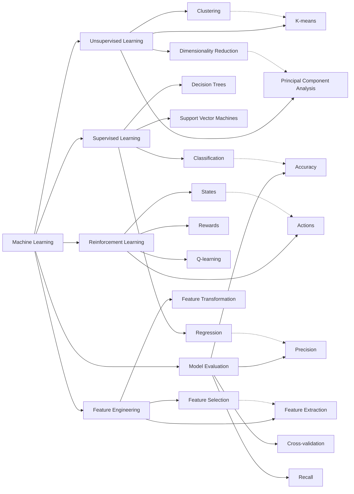

Here's the content converted to Markdown format:
AI Certification Exam Study Guide
This exam validates your knowledge of artificial intelligence, machine learning, generative AI concepts and use cases.
Machine Learning Approaches
Q: An organization is developing a model to predict the price of a product based on various features like size, weight, brand and manufacturing date. Which machine learning approach would be best suited for this task?
Options:

Classification
Regression
Clustering
Dimensionality reduction

A: Regression
Explanation:

Clustering groups similar data points together
Dimensionality reduction reduces the number of features
Regression predicts a continuous numerical value
Classification predicts categorical outcomes

AI Principles for Enterprises
Q: A company is expanding its use of artificial intelligence. Which core principles should they prioritize to establish clear guidelines, oversight and accountability for AI development and use?
Options:

Bias prevention
Accuracy and reliability
Data protection and security
Governance

A: Governance
Explanation: Governance encompasses the overall framework for managing AI systems including policies, procedures and decision-making processes. Other options are important too, but for oversight, governance is the best answer.
AWS AI Services
Q: A company is starting to use generative AI on AWS. To ensure responsible AI practices, which tool can provide them with guidance and information?
Options:

AWS Marketplace
AWS AI Service Cards
SageMaker
Bedrock

A: AWS AI Service Cards
Explanation: AI Service Cards offer detailed information on specific AWS AI services including their intended use cases, limitations and responsible design considerations.
Feature Engineering
Q: What is the primary purpose of feature engineering in machine learning?
Options:
A. To ensure consistent performance of the model
B. To evaluate the model's performance
C. To gather and pre-process data features
D. To transform data and create variables or features for the model
A: D. To transform data and create variables or features for the model
AWS SageMaker Tools
Q: A small company wants to use machine learning to predict customer churn but they lack an expert dedicated data science team. Which AWS tool can help them build models easily without extensive coding?
Options:
A. Amazon SageMaker Jumpstart
B. SageMaker Studio
C. SageMaker Canvas
D. SageMaker Data Wrangler
A: C. SageMaker Canvas
Explanation: SageMaker Canvas is a visual interface for building machine learning models without writing code.
MLOps
Q: A financial institution is developing a fraud detection model. The project lead announced that they would be using MLOps. How do you explain MLOps in the context of this project?
Options:
A. A tool for visualizing ML model performance
B. A set of practices for managing the entire lifecycle of ML systems
C. A process for deploying and maintaining ML models in production
D. A framework for building and training ML models
A: B. A set of practices for managing the entire lifecycle of ML systems
Explanation: MLOps encompasses the full lifecycle including development, deployment, monitoring and maintenance of machine learning models.
AWS Services for Chatbots
Q: Which AWS service can be used to create a knowledge-based chatbot that can answer questions about a company's products and services using the company's internal documents as a source of information?
Options:
A. Amazon SageMaker
B. Amazon Q Business
C. Amazon Polly
D. Amazon Recognition
A: B. Amazon Q Business
Explanation: It allows businesses to create intelligent chatbots and search interfaces that can answer questions based on their enterprise documents and data.
Vector Embeddings Storage
Q: A development team needs to select a service for storing and querying vector embeddings. Which AWS service is best suited for this?
Options:
A. Glue Data Catalog
B. Amazon S3
C. Redshift
D. OpenSearch Service
A: D. Amazon OpenSearch Service
Explanation: Here are some services that support vector-based storage and search: Amazon OpenSearch, Amazon MemoryDB, Amazon Aurora RDS Postgres, Amazon Kendra, and there are other products like Pinecone, Milvus, VV8, and Qdrant.
AWS Compliance Reports
Q: An organization wants to evaluate the security and compliance practices of AWS services used by vendors selling AI products. Which AWS service can help them access AWS compliance reports and certifications?
Options:
A. AWS organization
B. Amazon inspector
C. AWS CloudTrail
D. AWS artifact
A: D. AWS artifact
Explanation: It allows users to access a centralized repository of AWS compliance reports, attestations and certifications. This includes reports related to security, privacy and regulatory compliance.
Machine Learning Model Performance
Q: A machine learning model performs well on training data but poorly on new data. What is the likely problem?
Options:
A. Overfitting
B. Underfitting
C. Insufficient training data
D. Poor data quality
A: A. Overfitting
Explanation: Overfitting is the most likely cause of high accuracy on training data but low accuracy on testing data. This occurs when a model becomes overly complex and learns the training data too well to the point where it can't generalize to new or unseen data.
Large Language Model Enhancements
Q: A company wants to improve the quality of large language model responses by accessing external information. Which method requires the least amount of development effort?
Options:
A. Few-shot learning
B. Zero-shot learning
C. Retrieval augmented generation (RAG)
D. Fine-tuning
A: C. Retrieval augmented generation (RAG)
Explanation: RAG can retrieve and incorporate external information into prompts that are sent to LLM.
Machine Learning Concepts
Q: A model has been trained to recognize handwritten digits in images. However, the model is not accurate. An ML expert has advised that EPOCH value should be increased. What is EPOCH in the context of machine learning?
Options:
A. A measure of accuracy of a model during training
B. A single pass through the entire training data set by the model
C. The process of splitting the data set into training and testing sets
D. Number of layers in a neural network
A: B. A single pass through the entire training data set by the model
Explanation: During each epoch, the model processes all the data once, adjusting its parameters based on the loss or error calculated after each pass. Multiple epochs are typically used to iteratively improve the model's performance.
Hyperparameters in Machine Learning
Q: Which of the following is considered a hyperparameter in a machine learning model?
Options:
A. Weights of the neural network
B. Learning rate of the optimization algorithm
C. Output of the activation function
D. Predictions made by the model
A: B. Learning rate of the optimization algorithm
Explanation: In machine learning, the learning rate is a hyperparameter that determines the size of the steps the model takes when adjusting its weights during training. Specifically, it controls how much to change the model's parameters in response to the error or loss between the predicted output and the actual target.
Inference Time Parameters
Q: A model tends to give very similar outputs even when you vary the input slightly. Which inference time parameter can be adjusted to make it a little more creative?
Options:
A. Learning rate
B. Batch size
C. Temperature
D. Epochs
A: C. Temperature
Explanation: Temperature controls the randomness of predictions by adjusting the probability distribution used during sampling. Lower temperature makes the model more deterministic while higher temperature increases randomness and diversity.
Evaluation Metrics for Language Generation Models
Q: You are evaluating a language generation model on various tasks related to text generation. To assess the quality of the generated text, which evaluation metric best measures its semantic similarity to human-written text?
Options:
A. BERT score
B. BLEU
C. Perplexity
D. ROUGE
A: A. BERT score
Explanation: This metric leverages a pre-trained language model to calculate semantic similarity between text. It is particularly well-suited for tasks like machine translation and summarization where semantic meaning is crucial.
AWS Services for Model Explainability
Q: A developer is designing an AI system and needs a solution that provides comprehensive tools for analyzing and explaining model predictions. Which AWS service is specifically designed to enhance transparency and explainability in this context?
Options:
A. SageMaker Clarify
B. SageMaker Debugger
C. SageMaker Autopilot
D. SageMaker Data Wrangler
A: A. SageMaker Clarify
Explanation: SageMaker Clarify provides tools for analyzing model predictions and detecting bias, enhancing transparency and explainability.
Foundation Model Development
Q: A company plans to train and build its own foundation model. What are potential drawbacks of this approach against using a pre-trained foundation model?
Options:
A. More complex implementation process
B. Reduced performance
C. Risk of higher hallucination
D. Increased development cost
A: A and D are the correct answers
Explanation: More complex implementation process and increased development cost are potential drawbacks of building a custom foundation model compared to using a pre-trained one.
AWS Services for Content Generation
Q: A company wants to generate content using an existing popular pre-trained AI model. They have limited AI expertise and don't want to manage the model themselves. Which AWS service would best suit their needs?
Options:
A. Amazon Textract
B. Amazon Comprehend
C. Amazon Bedrock
D. Amazon SageMaker
A: C. Amazon Bedrock
Explanation: Bedrock is a managed service that provides access to pre-trained foundation models, making it ideal for companies that want to leverage AI without the need for extensive technical expertise or infrastructure.
AWS Services for Compliance Logging
Q: A company needs to log API calls to Amazon Bedrock for compliance, including details about the API call, the user and the timestamp. Which AWS service can assist with this?
Options:
A. CloudTrail
B. CloudWatch
C. IAM
D. Security Hub
A: A. CloudTrail
Explanation: CloudTrail can record API calls made to AWS services including the details of the API call, the user who made it, and the timestamp, making it suitable for tracking API activity for compliance purposes.
Machine Learning Pipeline Optimization
Q: A data science team wants to improve a model's performance. They want to increase the amount and diversity of data used for training and modify the algorithm's learning rate. Which combination of ML pipeline steps will meet these requirements?
Options:
A. Data augmentation
B. Model monitoring
C. Feature engineering
D. Hyperparameter tuning
A: A and D. Data Augmentation and Hyperparameter Tuning
Explanation:

Data augmentation is a technique used to artificially increase the size and diversity of a dataset by applying various transformations to existing data points, thereby providing the model with more examples to learn from.
Hyperparameter tuning involves adjusting the learning rate, which is a crucial parameter that controls how quickly the model updates its weights during training.

AWS Services for Content Moderation
Q: A company wants to ensure that the content generated by their Amazon Bedrock-powered application adheres to their ethical guidelines and avoids harmful or offensive content. Which AWS service can help them implement these safeguards?
Options:
A. Amazon SageMaker
B. Amazon Comprehend
C. Textract
D. Guardrails for Amazon Bedrock
A: D. Guardrails for Amazon Bedrock
Explanation: Guardrails ensure responsible use of foundation models, aligning with organizational compliance requirements. It prevents harmful, biased, or inappropriate content generation by filtering and monitoring outputs.
Data Privacy in Machine Learning
Q: Your company is training a machine learning model on a dataset stored in S3 that contains sensitive customer information. How can you ensure that any sensitive information in the data is removed or anonymized before training the model?
Options:
A. Use S3 encryption to protect the data at rest
B. Use Amazon Macie to identify sensitive information within the dataset
C. Use S3 access controls to limit access to authorized personnel
D. Implement data masking techniques to replace sensitive information
A: B and D are the correct answers
Explanation: Use Amazon Macie to identify sensitive information within the dataset and implement data masking techniques to replace sensitive information. Other options help secure the data but are not relevant to removing or anonymizing sensitive data.
Generative AI for Marketing
Q: A company wants to use Generative AI to create marketing slogans for their products. Why should the company carefully review all generated slogans?
Options:
A. Generative AI may generate slogans that are too long and difficult to remember
B. Generative AI may struggle to capture the unique brand identity of the company
C. Generative AI may produce slogans that are inappropriate or misleading
D. Generative AI may require extensive training data to generate effective slogans
A: C. Generative AI may produce slogans that are inappropriate or misleading
Explanation: Gen AI can sometimes generate content that is biased or offensive. This may be due to the biases present in the data they are trained on. Therefore, human oversight is essential to ensure the quality and appropriateness of the generated slogans.
AWS Services for Infrastructure Security
Q: Your company is training machine learning models on EC2 instances. You are concerned about the security of these models and want to identify potential vulnerabilities in the underlying infrastructure. Which AWS service can help you scan your EC2 instances for vulnerabilities?
Options:
A. AWS X-Ray
B. Amazon CloudWatch
C. Amazon Inspector
D. AWS Config
A: C. Amazon Inspector
Explanation: Amazon Inspector is a security service that helps you identify vulnerabilities in your EC2 instances.
Types of Bias in Machine Learning
Q: A machine learning model for loan approvals performs better for applicants from urban areas because the training data contains more approval examples from urban areas. What type of bias is this an example of?
Options:
A. Sampling bias
B. Algorithm bias
C. Observer bias
D. Recency bias
A: A. Sampling bias
Explanation: Sampling bias occurs when the training data is not representative of all scenarios.
Machine Learning Algorithms for Social Network Analysis
Q: For a dataset of social network connections where each user has relationships with multiple other users, which machine learning algorithm is most suitable for classifying these interconnected relationships into predefined categories?
Options:
A. Linear regression
B. Decision trees
C. Graph Neural Networks
D. Logistic Regression
A: C. Graph Neural Networks
Explanation: Graph neural networks classify interconnected data by leveraging graph structures to capture relationships between nodes.
Machine Learning Paradigms for Robotics
Q: A robot is tasked with navigating a maze to reach a goal. Which machine learning paradigm would be most suitable for training the robot to learn the optimal path via self-learning, trial and error?
Options:
A. Supervised learning
B. Unsupervised learning
C. Random learning
D. Reinforcement learning
A: D. Reinforcement learning
Explanation: Reinforcement learning trains a model to perform well on a new domain-specific task with limited labeled data.
Domain Adaptation in Machine Learning
Q: A pre-trained language model needs to be adapted to perform well on a new domain-specific task with limited labeled data. Which of the following approaches would be most efficient and suitable?
Options:
A. Continued pre-training with additional unlabeled data
B. Fine-tuning with labeled data from the new domain
C. Using a pre-trained model without any further adjustment
D. Training from scratch with new labeled data
A: B. Fine-tuning with labeled data from the new domain
Explanation: Fine-tuning is appropriate for adapting a model to perform well on a specific task with labeled data. It caters to domain-specific training most efficiently. It could also be referred to as domain adaptation fine-tuning.
Amazon Bedrock Pricing Models
Q: If you are a small startup with unpredictable workloads and need to experiment with different foundation models, which pricing model would be most suitable for you on Amazon Bedrock?
Options:
A. On-demand
B. Provisioned throughput
C. Model customization
D. Custom contracts
A: A. On-demand
Explanation: On-demand is a pay-as-you-go model for flexible usage, ideal for unpredictable workloads.
Natural Language Processing Concepts
Q: In the context of natural language processing, which of the following is a fundamental unit of text used to represent words or sub-words?
Options:
A. Token
B. Vector embedding
C. N-gram
D. Vocabulary
A: A. Token
Explanation: Token is the basic unit of text used to represent words or subwords after tokenization.
AWS Tools for Model Documentation
Q: A developer is creating an AI system to predict customer churn. To ensure transparency, they need to document key details about the model. Which AWS tool is best suited for this task?
Options:
A. Amazon SageMaker Clarify
B. AWS AI Service Cards
C. SageMaker Model Cards
D. SageMaker Jumpstart
A: C. Amazon SageMaker Model Cards
Explanation: Amazon